# Dengue Infections 2016
Michelle Evans  
`r format(Sys.Date())`  

This document is for the analysis of both the August and October Trials of Infections of the Dengue Microclimate project in Athens, GA in 2016.


```r
library(xtable)
library(tidyr)
library(ggplot2) 
library(lme4) #mixed models
```

```
## Loading required package: Matrix
```

```
## 
## Attaching package: 'Matrix'
```

```
## The following object is masked from 'package:tidyr':
## 
##     expand
```

```r
library(car)
library(MASS)
library(dplyr)
```

```
## 
## Attaching package: 'dplyr'
```

```
## The following object is masked from 'package:MASS':
## 
##     select
```

```
## The following object is masked from 'package:car':
## 
##     recode
```

```
## The following objects are masked from 'package:stats':
## 
##     filter, lag
```

```
## The following objects are masked from 'package:base':
## 
##     intersect, setdiff, setequal, union
```

```r
library(gridExtra) #for facet grids later
```

```
## 
## Attaching package: 'gridExtra'
```

```
## The following object is masked from 'package:dplyr':
## 
##     combine
```

```r
library(gbm)
```

```
## Loading required package: survival
```

```
## Loading required package: lattice
```

```
## Loading required package: splines
```

```
## Loading required package: parallel
```

```
## Loaded gbm 2.1.1
```

```r
library(caret)
```

```
## 
## Attaching package: 'caret'
```

```
## The following object is masked from 'package:survival':
## 
##     cluster
```

```r
library(pROC)
```

```
## Type 'citation("pROC")' for a citation.
```

```
## 
## Attaching package: 'pROC'
```

```
## The following objects are masked from 'package:stats':
## 
##     cov, smooth, var
```

```r
library(corrplot)
library(glmnet)
```

```
## Loading required package: foreach
```

```
## Loaded glmnet 2.0-5
```

```
## 
## Attaching package: 'glmnet'
```

```
## The following object is masked from 'package:pROC':
## 
##     auc
```

```r
knitr::opts_chunk$set(cache=TRUE, message=F)
```


```r
colR <- colRural <- "dodgerblue"
colS <- colSuburban <- "gray80"
colU <- colUrban <- "maroon"
```

# Load and Format


```r
formatData <- function(month){
  #' format infection data
  #' @params month (ie. "august")
  #' @returns dataframe of properly formatted data
  #adjust wingLength
  monthDf <- read.csv(paste0("../../data/infections/raw/", month,"Dengue.csv"))
  #convert wingLength and drop extra columns
  monthDf$Wing <- monthDf$WingLength*monthDf$conversion..mm.bar.
  monthDf <- select(monthDf, -WingLength, -conversion..mm.bar.)
  
  #dpi as factor
  monthDf$DPI <- as.factor(monthDf$DPI)
  
  #add in class and site
  monthDf$site <- as.factor(substr(as.character(monthDf$Individual), 1, 2))
  monthDf$class <- NULL
  for (i in 1:nrow(monthDf)){
    if (substr(monthDf$site[i], 1,1)=="R"){
    monthDf$class[i] <- "Rural"
    } else if (substr(monthDf$site[i], 1,1)=="S"){
    monthDf$class[i] <- "Suburban"
    } else if (substr(monthDf$site[i], 1,1)=="U"){
    monthDf$class[i] <- "Urban"
    }
  }
  monthDf$class <- as.factor(monthDf$class)
  
  #convert Y and N to 1 and 0 for statistics
  levels(monthDf$Body) <- c("NA", 0, 1)
  monthDf$Body <- as.numeric(as.character(monthDf$Body))
  levels(monthDf$Saliva) <- c("NA", 0, 1)
  monthDf$Saliva <- as.numeric(as.character(monthDf$Saliva))
  # august had no contaminated heads, so different corrections
  if (month=="august"){
    levels(monthDf$Head) <- c(0, 1)
  } else levels(monthDf$Head) <- c("NA",0, 1)
  monthDf$Head <- as.numeric(as.character(monthDf$Head))
  
  ##Fix false negatievs
  #adjust so that if saliva is positive, so is head
  #ddjust so that is head is positive, so is body
  monthDf$Head[monthDf$Saliva>0] <- 1
  monthDf$Body[monthDf$Head>0] <- 1
  
  return(monthDf)
}
```


```r
#warning messages about NAs are fine
august <- formatData("august")
```

```
## Warning in formatData("august"): NAs introduced by coercion

## Warning in formatData("august"): NAs introduced by coercion
```

```r
oct <- formatData("october")
```

```
## Warning in formatData("october"): NAs introduced by coercion
```

```
## Warning in formatData("october"): NAs introduced by coercion

## Warning in formatData("october"): NAs introduced by coercion
```

First, lets create a table of the percentages for an overview:


```r
augustSumm <- august %>%
  #drop individual
  select(-Individual) %>%
  group_by(DPI, site, class) %>%
  summarise_each(funs(mean(.,na.rm=T),sd(.,na.rm=T),se=(sd(., na.rm=T)/sqrt(n())))) %>%
  ungroup()

print(xtable(augustSumm), type="html")
```

```
## <!-- html table generated in R 3.3.3 by xtable 1.8-2 package -->
## <!-- Wed Mar 29 12:45:13 2017 -->
## <table border=1>
## <tr> <th>  </th> <th> DPI </th> <th> site </th> <th> class </th> <th> Body_mean </th> <th> Head_mean </th> <th> Saliva_mean </th> <th> Wing_mean </th> <th> Body_sd </th> <th> Head_sd </th> <th> Saliva_sd </th> <th> Wing_sd </th> <th> Body_se </th> <th> Head_se </th> <th> Saliva_se </th> <th> Wing_se </th>  </tr>
##   <tr> <td align="right"> 1 </td> <td> 9 </td> <td> R1 </td> <td> Rural </td> <td align="right"> 0.25 </td> <td align="right"> 0.05 </td> <td align="right"> 0.00 </td> <td align="right"> 2.45 </td> <td align="right"> 0.44 </td> <td align="right"> 0.22 </td> <td align="right"> 0.00 </td> <td align="right"> 0.13 </td> <td align="right"> 0.10 </td> <td align="right"> 0.05 </td> <td align="right"> 0.00 </td> <td align="right"> 0.03 </td> </tr>
##   <tr> <td align="right"> 2 </td> <td> 9 </td> <td> R2 </td> <td> Rural </td> <td align="right"> 0.15 </td> <td align="right"> 0.10 </td> <td align="right"> 0.00 </td> <td align="right"> 2.35 </td> <td align="right"> 0.37 </td> <td align="right"> 0.31 </td> <td align="right"> 0.00 </td> <td align="right"> 0.11 </td> <td align="right"> 0.08 </td> <td align="right"> 0.07 </td> <td align="right"> 0.00 </td> <td align="right"> 0.03 </td> </tr>
##   <tr> <td align="right"> 3 </td> <td> 9 </td> <td> R3 </td> <td> Rural </td> <td align="right"> 0.00 </td> <td align="right"> 0.00 </td> <td align="right"> 0.00 </td> <td align="right"> 2.48 </td> <td align="right"> 0.00 </td> <td align="right"> 0.00 </td> <td align="right"> 0.00 </td> <td align="right"> 0.09 </td> <td align="right"> 0.00 </td> <td align="right"> 0.00 </td> <td align="right"> 0.00 </td> <td align="right"> 0.02 </td> </tr>
##   <tr> <td align="right"> 4 </td> <td> 9 </td> <td> S1 </td> <td> Suburban </td> <td align="right"> 0.15 </td> <td align="right"> 0.10 </td> <td align="right"> 0.00 </td> <td align="right"> 2.50 </td> <td align="right"> 0.37 </td> <td align="right"> 0.31 </td> <td align="right"> 0.00 </td> <td align="right"> 0.12 </td> <td align="right"> 0.08 </td> <td align="right"> 0.07 </td> <td align="right"> 0.00 </td> <td align="right"> 0.03 </td> </tr>
##   <tr> <td align="right"> 5 </td> <td> 9 </td> <td> S2 </td> <td> Suburban </td> <td align="right"> 0.05 </td> <td align="right"> 0.00 </td> <td align="right"> 0.00 </td> <td align="right"> 2.26 </td> <td align="right"> 0.23 </td> <td align="right"> 0.00 </td> <td align="right"> 0.00 </td> <td align="right"> 0.14 </td> <td align="right"> 0.05 </td> <td align="right"> 0.00 </td> <td align="right"> 0.00 </td> <td align="right"> 0.03 </td> </tr>
##   <tr> <td align="right"> 6 </td> <td> 9 </td> <td> S3 </td> <td> Suburban </td> <td align="right"> 0.30 </td> <td align="right"> 0.00 </td> <td align="right"> 0.00 </td> <td align="right"> 2.51 </td> <td align="right"> 0.47 </td> <td align="right"> 0.00 </td> <td align="right"> 0.00 </td> <td align="right"> 0.13 </td> <td align="right"> 0.11 </td> <td align="right"> 0.00 </td> <td align="right"> 0.00 </td> <td align="right"> 0.03 </td> </tr>
##   <tr> <td align="right"> 7 </td> <td> 9 </td> <td> U1 </td> <td> Urban </td> <td align="right"> 0.25 </td> <td align="right"> 0.10 </td> <td align="right"> 0.00 </td> <td align="right"> 2.59 </td> <td align="right"> 0.44 </td> <td align="right"> 0.31 </td> <td align="right"> 0.00 </td> <td align="right"> 0.09 </td> <td align="right"> 0.10 </td> <td align="right"> 0.07 </td> <td align="right"> 0.00 </td> <td align="right"> 0.02 </td> </tr>
##   <tr> <td align="right"> 8 </td> <td> 9 </td> <td> U2 </td> <td> Urban </td> <td align="right"> 0.10 </td> <td align="right"> 0.05 </td> <td align="right"> 0.00 </td> <td align="right"> 2.55 </td> <td align="right"> 0.31 </td> <td align="right"> 0.22 </td> <td align="right"> 0.00 </td> <td align="right"> 0.11 </td> <td align="right"> 0.07 </td> <td align="right"> 0.05 </td> <td align="right"> 0.00 </td> <td align="right"> 0.02 </td> </tr>
##   <tr> <td align="right"> 9 </td> <td> 9 </td> <td> U3 </td> <td> Urban </td> <td align="right"> 0.00 </td> <td align="right"> 0.00 </td> <td align="right"> 0.00 </td> <td align="right"> 2.49 </td> <td align="right"> 0.00 </td> <td align="right"> 0.00 </td> <td align="right"> 0.00 </td> <td align="right"> 0.12 </td> <td align="right"> 0.00 </td> <td align="right"> 0.00 </td> <td align="right"> 0.00 </td> <td align="right"> 0.03 </td> </tr>
##   <tr> <td align="right"> 10 </td> <td> 14 </td> <td> R1 </td> <td> Rural </td> <td align="right"> 0.10 </td> <td align="right"> 0.10 </td> <td align="right"> 0.10 </td> <td align="right"> 2.47 </td> <td align="right"> 0.31 </td> <td align="right"> 0.31 </td> <td align="right"> 0.31 </td> <td align="right"> 0.16 </td> <td align="right"> 0.07 </td> <td align="right"> 0.07 </td> <td align="right"> 0.07 </td> <td align="right"> 0.04 </td> </tr>
##   <tr> <td align="right"> 11 </td> <td> 14 </td> <td> R2 </td> <td> Rural </td> <td align="right"> 0.20 </td> <td align="right"> 0.10 </td> <td align="right"> 0.00 </td> <td align="right"> 2.35 </td> <td align="right"> 0.41 </td> <td align="right"> 0.31 </td> <td align="right"> 0.00 </td> <td align="right"> 0.18 </td> <td align="right"> 0.09 </td> <td align="right"> 0.07 </td> <td align="right"> 0.00 </td> <td align="right"> 0.04 </td> </tr>
##   <tr> <td align="right"> 12 </td> <td> 14 </td> <td> R3 </td> <td> Rural </td> <td align="right"> 0.15 </td> <td align="right"> 0.10 </td> <td align="right"> 0.00 </td> <td align="right"> 2.57 </td> <td align="right"> 0.37 </td> <td align="right"> 0.31 </td> <td align="right"> 0.00 </td> <td align="right"> 0.12 </td> <td align="right"> 0.08 </td> <td align="right"> 0.07 </td> <td align="right"> 0.00 </td> <td align="right"> 0.03 </td> </tr>
##   <tr> <td align="right"> 13 </td> <td> 14 </td> <td> S1 </td> <td> Suburban </td> <td align="right"> 0.25 </td> <td align="right"> 0.25 </td> <td align="right"> 0.19 </td> <td align="right"> 2.53 </td> <td align="right"> 0.45 </td> <td align="right"> 0.45 </td> <td align="right"> 0.40 </td> <td align="right"> 0.08 </td> <td align="right"> 0.10 </td> <td align="right"> 0.10 </td> <td align="right"> 0.09 </td> <td align="right"> 0.02 </td> </tr>
##   <tr> <td align="right"> 14 </td> <td> 14 </td> <td> S2 </td> <td> Suburban </td> <td align="right"> 0.25 </td> <td align="right"> 0.25 </td> <td align="right"> 0.00 </td> <td align="right"> 2.34 </td> <td align="right"> 0.44 </td> <td align="right"> 0.44 </td> <td align="right"> 0.00 </td> <td align="right"> 0.10 </td> <td align="right"> 0.10 </td> <td align="right"> 0.10 </td> <td align="right"> 0.00 </td> <td align="right"> 0.02 </td> </tr>
##   <tr> <td align="right"> 15 </td> <td> 14 </td> <td> S3 </td> <td> Suburban </td> <td align="right"> 0.15 </td> <td align="right"> 0.15 </td> <td align="right"> 0.05 </td> <td align="right"> 2.50 </td> <td align="right"> 0.37 </td> <td align="right"> 0.37 </td> <td align="right"> 0.22 </td> <td align="right"> 0.10 </td> <td align="right"> 0.08 </td> <td align="right"> 0.08 </td> <td align="right"> 0.05 </td> <td align="right"> 0.02 </td> </tr>
##   <tr> <td align="right"> 16 </td> <td> 14 </td> <td> U1 </td> <td> Urban </td> <td align="right"> 0.10 </td> <td align="right"> 0.10 </td> <td align="right"> 0.00 </td> <td align="right"> 2.66 </td> <td align="right"> 0.31 </td> <td align="right"> 0.31 </td> <td align="right"> 0.00 </td> <td align="right"> 0.10 </td> <td align="right"> 0.07 </td> <td align="right"> 0.07 </td> <td align="right"> 0.00 </td> <td align="right"> 0.02 </td> </tr>
##   <tr> <td align="right"> 17 </td> <td> 14 </td> <td> U2 </td> <td> Urban </td> <td align="right"> 0.35 </td> <td align="right"> 0.20 </td> <td align="right"> 0.10 </td> <td align="right"> 2.63 </td> <td align="right"> 0.49 </td> <td align="right"> 0.41 </td> <td align="right"> 0.31 </td> <td align="right"> 0.09 </td> <td align="right"> 0.11 </td> <td align="right"> 0.09 </td> <td align="right"> 0.07 </td> <td align="right"> 0.02 </td> </tr>
##   <tr> <td align="right"> 18 </td> <td> 14 </td> <td> U3 </td> <td> Urban </td> <td align="right"> 0.45 </td> <td align="right"> 0.40 </td> <td align="right"> 0.05 </td> <td align="right"> 2.56 </td> <td align="right"> 0.51 </td> <td align="right"> 0.50 </td> <td align="right"> 0.22 </td> <td align="right"> 0.10 </td> <td align="right"> 0.11 </td> <td align="right"> 0.11 </td> <td align="right"> 0.05 </td> <td align="right"> 0.02 </td> </tr>
##   <tr> <td align="right"> 19 </td> <td> 21 </td> <td> R1 </td> <td> Rural </td> <td align="right"> 0.37 </td> <td align="right"> 0.30 </td> <td align="right"> 0.10 </td> <td align="right"> 2.41 </td> <td align="right"> 0.50 </td> <td align="right"> 0.47 </td> <td align="right"> 0.31 </td> <td align="right"> 0.12 </td> <td align="right"> 0.11 </td> <td align="right"> 0.11 </td> <td align="right"> 0.07 </td> <td align="right"> 0.03 </td> </tr>
##   <tr> <td align="right"> 20 </td> <td> 21 </td> <td> R2 </td> <td> Rural </td> <td align="right"> 0.37 </td> <td align="right"> 0.30 </td> <td align="right"> 0.10 </td> <td align="right"> 2.42 </td> <td align="right"> 0.50 </td> <td align="right"> 0.47 </td> <td align="right"> 0.31 </td> <td align="right"> 0.11 </td> <td align="right"> 0.11 </td> <td align="right"> 0.11 </td> <td align="right"> 0.07 </td> <td align="right"> 0.02 </td> </tr>
##   <tr> <td align="right"> 21 </td> <td> 21 </td> <td> R3 </td> <td> Rural </td> <td align="right"> 0.44 </td> <td align="right"> 0.35 </td> <td align="right"> 0.10 </td> <td align="right"> 2.54 </td> <td align="right"> 0.51 </td> <td align="right"> 0.49 </td> <td align="right"> 0.31 </td> <td align="right"> 0.10 </td> <td align="right"> 0.11 </td> <td align="right"> 0.11 </td> <td align="right"> 0.07 </td> <td align="right"> 0.02 </td> </tr>
##   <tr> <td align="right"> 22 </td> <td> 21 </td> <td> S1 </td> <td> Suburban </td> <td align="right"> 0.71 </td> <td align="right"> 0.71 </td> <td align="right"> 0.35 </td> <td align="right"> 2.51 </td> <td align="right"> 0.47 </td> <td align="right"> 0.47 </td> <td align="right"> 0.49 </td> <td align="right"> 0.09 </td> <td align="right"> 0.11 </td> <td align="right"> 0.11 </td> <td align="right"> 0.11 </td> <td align="right"> 0.02 </td> </tr>
##   <tr> <td align="right"> 23 </td> <td> 21 </td> <td> S2 </td> <td> Suburban </td> <td align="right"> 0.60 </td> <td align="right"> 0.50 </td> <td align="right"> 0.10 </td> <td align="right"> 2.44 </td> <td align="right"> 0.50 </td> <td align="right"> 0.51 </td> <td align="right"> 0.31 </td> <td align="right"> 0.10 </td> <td align="right"> 0.11 </td> <td align="right"> 0.11 </td> <td align="right"> 0.07 </td> <td align="right"> 0.02 </td> </tr>
##   <tr> <td align="right"> 24 </td> <td> 21 </td> <td> S3 </td> <td> Suburban </td> <td align="right"> 0.40 </td> <td align="right"> 0.20 </td> <td align="right"> 0.10 </td> <td align="right"> 2.50 </td> <td align="right"> 0.50 </td> <td align="right"> 0.41 </td> <td align="right"> 0.31 </td> <td align="right"> 0.10 </td> <td align="right"> 0.11 </td> <td align="right"> 0.09 </td> <td align="right"> 0.07 </td> <td align="right"> 0.02 </td> </tr>
##   <tr> <td align="right"> 25 </td> <td> 21 </td> <td> U1 </td> <td> Urban </td> <td align="right"> 0.25 </td> <td align="right"> 0.25 </td> <td align="right"> 0.15 </td> <td align="right"> 2.65 </td> <td align="right"> 0.44 </td> <td align="right"> 0.44 </td> <td align="right"> 0.37 </td> <td align="right"> 0.10 </td> <td align="right"> 0.10 </td> <td align="right"> 0.10 </td> <td align="right"> 0.08 </td> <td align="right"> 0.02 </td> </tr>
##   <tr> <td align="right"> 26 </td> <td> 21 </td> <td> U2 </td> <td> Urban </td> <td align="right"> 0.21 </td> <td align="right"> 0.20 </td> <td align="right"> 0.20 </td> <td align="right"> 2.62 </td> <td align="right"> 0.42 </td> <td align="right"> 0.41 </td> <td align="right"> 0.41 </td> <td align="right"> 0.09 </td> <td align="right"> 0.09 </td> <td align="right"> 0.09 </td> <td align="right"> 0.09 </td> <td align="right"> 0.02 </td> </tr>
##   <tr> <td align="right"> 27 </td> <td> 21 </td> <td> U3 </td> <td> Urban </td> <td align="right"> 0.08 </td> <td align="right"> 0.08 </td> <td align="right"> 0.00 </td> <td align="right"> 2.58 </td> <td align="right"> 0.29 </td> <td align="right"> 0.28 </td> <td align="right"> 0.00 </td> <td align="right"> 0.11 </td> <td align="right"> 0.06 </td> <td align="right"> 0.06 </td> <td align="right"> 0.00 </td> <td align="right"> 0.03 </td> </tr>
##    </table>
```

```r
octSumm <- oct %>%
  #drop individual
  select(-Individual) %>%
  group_by(DPI, site, class) %>%
  summarise_each(funs(mean(.,na.rm=T),sd(.,na.rm=T),se=(sd(., na.rm=T)/sqrt(n())))) %>%
  ungroup()

print(xtable(octSumm), type="html")
```

```
## <!-- html table generated in R 3.3.3 by xtable 1.8-2 package -->
## <!-- Wed Mar 29 12:45:13 2017 -->
## <table border=1>
## <tr> <th>  </th> <th> DPI </th> <th> site </th> <th> class </th> <th> Body_mean </th> <th> Head_mean </th> <th> Saliva_mean </th> <th> Wing_mean </th> <th> Body_sd </th> <th> Head_sd </th> <th> Saliva_sd </th> <th> Wing_sd </th> <th> Body_se </th> <th> Head_se </th> <th> Saliva_se </th> <th> Wing_se </th>  </tr>
##   <tr> <td align="right"> 1 </td> <td> 21 </td> <td> R1 </td> <td> Rural </td> <td align="right"> 0.60 </td> <td align="right"> 0.60 </td> <td align="right"> 0.00 </td> <td align="right"> 2.45 </td> <td align="right"> 0.52 </td> <td align="right"> 0.52 </td> <td align="right"> 0.00 </td> <td align="right"> 0.06 </td> <td align="right"> 0.16 </td> <td align="right"> 0.16 </td> <td align="right"> 0.00 </td> <td align="right"> 0.02 </td> </tr>
##   <tr> <td align="right"> 2 </td> <td> 21 </td> <td> R2 </td> <td> Rural </td> <td align="right"> 0.60 </td> <td align="right"> 0.60 </td> <td align="right"> 0.12 </td> <td align="right"> 2.37 </td> <td align="right"> 0.50 </td> <td align="right"> 0.50 </td> <td align="right"> 0.33 </td> <td align="right"> 0.14 </td> <td align="right"> 0.11 </td> <td align="right"> 0.11 </td> <td align="right"> 0.07 </td> <td align="right"> 0.03 </td> </tr>
##   <tr> <td align="right"> 3 </td> <td> 21 </td> <td> R3 </td> <td> Rural </td> <td align="right"> 0.70 </td> <td align="right"> 0.60 </td> <td align="right"> 0.05 </td> <td align="right"> 2.49 </td> <td align="right"> 0.47 </td> <td align="right"> 0.50 </td> <td align="right"> 0.22 </td> <td align="right"> 0.13 </td> <td align="right"> 0.11 </td> <td align="right"> 0.11 </td> <td align="right"> 0.05 </td> <td align="right"> 0.03 </td> </tr>
##   <tr> <td align="right"> 4 </td> <td> 21 </td> <td> S1 </td> <td> Suburban </td> <td align="right"> 0.65 </td> <td align="right"> 0.60 </td> <td align="right"> 0.10 </td> <td align="right"> 2.42 </td> <td align="right"> 0.49 </td> <td align="right"> 0.50 </td> <td align="right"> 0.31 </td> <td align="right"> 0.17 </td> <td align="right"> 0.11 </td> <td align="right"> 0.11 </td> <td align="right"> 0.07 </td> <td align="right"> 0.04 </td> </tr>
##   <tr> <td align="right"> 5 </td> <td> 21 </td> <td> S2 </td> <td> Suburban </td> <td align="right"> 0.75 </td> <td align="right"> 0.75 </td> <td align="right"> 0.25 </td> <td align="right"> 2.42 </td> <td align="right"> 0.50 </td> <td align="right"> 0.50 </td> <td align="right"> 0.50 </td> <td align="right"> 0.09 </td> <td align="right"> 0.25 </td> <td align="right"> 0.25 </td> <td align="right"> 0.25 </td> <td align="right"> 0.04 </td> </tr>
##   <tr> <td align="right"> 6 </td> <td> 21 </td> <td> S3 </td> <td> Suburban </td> <td align="right"> 0.63 </td> <td align="right"> 0.59 </td> <td align="right"> 0.00 </td> <td align="right"> 2.46 </td> <td align="right"> 0.50 </td> <td align="right"> 0.51 </td> <td align="right"> 0.00 </td> <td align="right"> 0.17 </td> <td align="right"> 0.11 </td> <td align="right"> 0.11 </td> <td align="right"> 0.00 </td> <td align="right"> 0.04 </td> </tr>
##   <tr> <td align="right"> 7 </td> <td> 21 </td> <td> U1 </td> <td> Urban </td> <td align="right"> 0.20 </td> <td align="right"> 0.16 </td> <td align="right"> 0.00 </td> <td align="right"> 2.56 </td> <td align="right"> 0.41 </td> <td align="right"> 0.37 </td> <td align="right"> 0.00 </td> <td align="right"> 0.14 </td> <td align="right"> 0.09 </td> <td align="right"> 0.08 </td> <td align="right"> 0.00 </td> <td align="right"> 0.03 </td> </tr>
##   <tr> <td align="right"> 8 </td> <td> 21 </td> <td> U2 </td> <td> Urban </td> <td align="right"> 0.58 </td> <td align="right"> 0.50 </td> <td align="right"> 0.10 </td> <td align="right"> 2.58 </td> <td align="right"> 0.51 </td> <td align="right"> 0.51 </td> <td align="right"> 0.31 </td> <td align="right"> 0.11 </td> <td align="right"> 0.11 </td> <td align="right"> 0.12 </td> <td align="right"> 0.07 </td> <td align="right"> 0.02 </td> </tr>
##   <tr> <td align="right"> 9 </td> <td> 21 </td> <td> U3 </td> <td> Urban </td> <td align="right"> 0.55 </td> <td align="right"> 0.50 </td> <td align="right"> 0.10 </td> <td align="right"> 2.44 </td> <td align="right"> 0.51 </td> <td align="right"> 0.51 </td> <td align="right"> 0.31 </td> <td align="right"> 0.12 </td> <td align="right"> 0.11 </td> <td align="right"> 0.11 </td> <td align="right"> 0.07 </td> <td align="right"> 0.03 </td> </tr>
##    </table>
```

# Exploratory Visualizations

## Summary Plots by Site


```r
sitePlot <- function(summTable, dpi, bodyPart){
  cols <- c(1:3,grep(bodyPart, colnames(summTable)))
temp <- summTable[summTable$DPI==dpi,cols]
colnames(temp)[4:6] <- c("mean", "sd", "se")
  barCenters <- barplot(temp$mean, 
          col=c("gray80", "dodgerblue", "maroon")[temp$class],
          names.arg=temp$site,
          ylim=c(0,max(temp$mean+0.2)),
          main = paste0(bodyPart, " Infection (", dpi, "dpi)")
          )
  #add se bars
  segments(barCenters, temp$mean - temp$se , barCenters,
         temp$mean + temp$se, lwd = 1.5)
  
  arrows(barCenters, temp$mean - temp$se , barCenters,
         temp$mean + temp$se, lwd = 1.5, 
         angle = 90,
       code = 3, length = 0.05)
}
```


```r
par(mfrow=c(2,2))
sitePlot(summTable=augustSumm, dpi="9", bodyPart = "Body")
sitePlot(summTable=augustSumm, dpi="14", bodyPart = "Body")
sitePlot(summTable=augustSumm, dpi="21", bodyPart = "Body")

sitePlot(summTable=octSumm, dpi="21", bodyPart="Body")
mtext("October")
```


```r
par(mfrow=c(2,2))
sitePlot(summTable=augustSumm, dpi="9", bodyPart = "Head")
sitePlot(summTable=augustSumm, dpi="14", bodyPart = "Head")
sitePlot(summTable=augustSumm, dpi="21", bodyPart = "Head")

sitePlot(summTable=octSumm, dpi="21", bodyPart="Head")
mtext("October")
```


```r
sitePlot(summTable=augustSumm, dpi="9", bodyPart = "Saliva")
sitePlot(summTable=augustSumm, dpi="14", bodyPart = "Saliva")
sitePlot(summTable=augustSumm, dpi="21", bodyPart = "Saliva")

sitePlot(summTable=octSumm, dpi="21", bodyPart="Saliva")
mtext("October")
```

## Plotting them beside each other


```r
besidePlot <- function(summTable, bodyPart, byclass=F){
  if (byclass==T){
    cols <- c(1:2,grep(bodyPart, colnames(summTable)))
  } else cols <- c(1:3,grep(bodyPart, colnames(summTable)))
  tempLarge <- summTable[,cols]
  colnames(tempLarge)[(ncol(tempLarge)-2):ncol(tempLarge)] <- c("mean", "sd", "se")
  if (byclass==F){
  tempMean <- tempLarge %>%
    select(-sd,-se, -class) %>%
    spread(DPI, mean) %>%
    select(-site)
  } else tempMean <- tempLarge %>%
    select(-sd,-se) %>%
    spread( DPI, mean) %>%
    select(-class)
  if (byclass==T){
    rownames(tempMean) <- levels(summTable$class)
    } else rownames(tempMean) <- levels(summTable$site)
  tempMean <- t(as.matrix(tempMean))
  #colors
  if (byclass==T){
    colvec <- c(rep(colRural,3), rep(colSuburban,3), 
                            rep(colUrban,3))
  } else colvec <- c(rep(colRural,9), rep(colSuburban,9), 
                            rep(colUrban,9))
  #plot
  barCenters <- barplot(tempMean, 
                      beside=T,
                      col=colvec,
                      density = c(10,40,NA),
                      names.arg=colnames(tempMean),
                      ylim=c(0,0.80),
                      main = paste0("Dengue ", bodyPart," Infections"),
                      ylab = "Percent Infected"
                      )

    if (byclass==F){
  tempSE <- tempLarge %>%
    select(-sd,-mean,-class) %>%
    spread( DPI, se) %>%
    select(-site)
  } else   tempSE <- tempLarge %>%
    select(-sd,-mean) %>%
    spread( DPI, se) %>%
    select(-class)
  
  tempSE <- t(tempSE)
  
  #add se bars
  segments(barCenters, tempMean - tempSE , barCenters,
         tempMean + tempSE, lwd = 1.5)
  
  arrows(barCenters, tempMean - tempSE , barCenters,
         tempMean + tempSE,
         lwd = 1.5, 
         angle = 90,
         code = 3, length = 0.03)
  
  legend("topright", legend=c("9 dpi","14 dpi", "21 dpi"), density = c(10,40,NA),
       bty = "n", col = "gray80")
}
```

## August Plots by DPI

Note there are none of these for October becuase we only did 21 dpi.


```r
#pdf(file="../figures/augustBody.pdf", width = 8, height=6, family="sans")
besidePlot(summTable=augustSumm, bodyPart="Body")
```

```
## Warning: Setting row names on a tibble is deprecated.
```

```
## Warning in arrows(barCenters, tempMean - tempSE, barCenters, tempMean + :
## zero-length arrow is of indeterminate angle and so skipped

## Warning in arrows(barCenters, tempMean - tempSE, barCenters, tempMean + :
## zero-length arrow is of indeterminate angle and so skipped
```

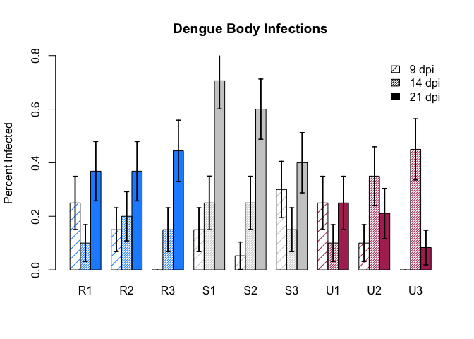<!-- -->

```r
#dev.off()
```


```r
#pdf(file="../figures/augustSaliva.pdf", width = 8, height=6, family="sans")
besidePlot(summTable=augustSumm, bodyPart="Saliva")
```

```
## Warning: Setting row names on a tibble is deprecated.
```

```
## Warning in arrows(barCenters, tempMean - tempSE, barCenters, tempMean + :
## zero-length arrow is of indeterminate angle and so skipped

## Warning in arrows(barCenters, tempMean - tempSE, barCenters, tempMean + :
## zero-length arrow is of indeterminate angle and so skipped

## Warning in arrows(barCenters, tempMean - tempSE, barCenters, tempMean + :
## zero-length arrow is of indeterminate angle and so skipped

## Warning in arrows(barCenters, tempMean - tempSE, barCenters, tempMean + :
## zero-length arrow is of indeterminate angle and so skipped

## Warning in arrows(barCenters, tempMean - tempSE, barCenters, tempMean + :
## zero-length arrow is of indeterminate angle and so skipped

## Warning in arrows(barCenters, tempMean - tempSE, barCenters, tempMean + :
## zero-length arrow is of indeterminate angle and so skipped

## Warning in arrows(barCenters, tempMean - tempSE, barCenters, tempMean + :
## zero-length arrow is of indeterminate angle and so skipped

## Warning in arrows(barCenters, tempMean - tempSE, barCenters, tempMean + :
## zero-length arrow is of indeterminate angle and so skipped

## Warning in arrows(barCenters, tempMean - tempSE, barCenters, tempMean + :
## zero-length arrow is of indeterminate angle and so skipped

## Warning in arrows(barCenters, tempMean - tempSE, barCenters, tempMean + :
## zero-length arrow is of indeterminate angle and so skipped

## Warning in arrows(barCenters, tempMean - tempSE, barCenters, tempMean + :
## zero-length arrow is of indeterminate angle and so skipped

## Warning in arrows(barCenters, tempMean - tempSE, barCenters, tempMean + :
## zero-length arrow is of indeterminate angle and so skipped

## Warning in arrows(barCenters, tempMean - tempSE, barCenters, tempMean + :
## zero-length arrow is of indeterminate angle and so skipped

## Warning in arrows(barCenters, tempMean - tempSE, barCenters, tempMean + :
## zero-length arrow is of indeterminate angle and so skipped
```

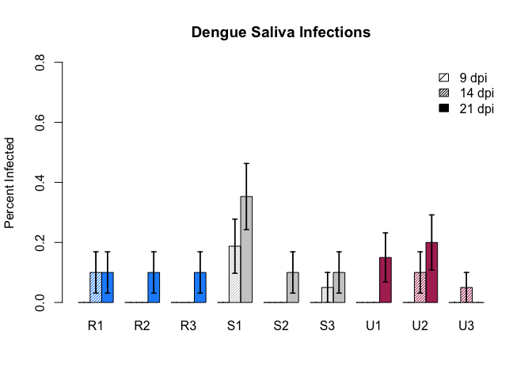<!-- -->

```r
#dev.off()
```


```r
#pdf(file="../figures/augustHead.pdf", width = 8, height=6, family="sans")
besidePlot(summTable=augustSumm, bodyPart="Head")
```

```
## Warning: Setting row names on a tibble is deprecated.
```

```
## Warning in arrows(barCenters, tempMean - tempSE, barCenters, tempMean + :
## zero-length arrow is of indeterminate angle and so skipped

## Warning in arrows(barCenters, tempMean - tempSE, barCenters, tempMean + :
## zero-length arrow is of indeterminate angle and so skipped

## Warning in arrows(barCenters, tempMean - tempSE, barCenters, tempMean + :
## zero-length arrow is of indeterminate angle and so skipped

## Warning in arrows(barCenters, tempMean - tempSE, barCenters, tempMean + :
## zero-length arrow is of indeterminate angle and so skipped
```

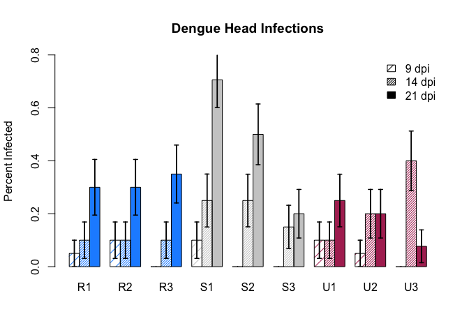<!-- -->

```r
#dev.off()
```

## Plots by Class


```r
besidePlotOct <- function(summTable, bodyPart, byclass=F){
  if (byclass==T){
    cols <- c(1,2,grep(bodyPart, colnames(summTable)))
  } else cols <- c(1:3,grep(bodyPart, colnames(summTable)))
  tempLarge <- summTable[,cols]
  colnames(tempLarge)[(ncol(tempLarge)-2):ncol(tempLarge)] <- c("mean", "sd", "se")
  if (byclass==F){
  tempMean <- tempLarge %>%
    select(-sd,-se, -class) %>%
    spread( DPI, mean) %>%
    select(-site)
  } else tempMean <- tempLarge %>%
    select(-sd,-se, -class, -DPI)
  if (byclass==T){
    rownames(tempMean) <- levels(summTable$class)
    } else rownames(tempMean) <- levels(summTable$site)
  tempMean <- t(as.matrix(tempMean))
  #colors
  if (byclass==T){
    colvec <- c(rep(colRural,1), rep(colSuburban,1), 
                            rep(colUrban,1))
  } else colvec <- c(rep(colRural,3), rep(colSuburban,3), 
                            rep(colUrban,3))
  #plot
  barCenters <- barplot(tempMean, 
                      beside=T,
                      col=colvec,
                      density = c(NA),
                      names.arg=colnames(tempMean),
                      ylim=c(0,0.80),
                      main = paste0("Dengue ", bodyPart," Infections"),
                      ylab = "Percent Infected"
                      )

    if (byclass==F){
  tempSE <- tempLarge %>%
    select(-sd,-mean,-class) %>%
    spread( DPI, se) %>%
    select(-site)
  } else   tempSE <- tempLarge %>%
    select(-sd,-mean) %>%
    spread( DPI, se) %>%
    select(-class)
  
  tempSE <- t(tempSE)
  
  #add se bars
  segments(barCenters, tempMean - tempSE , barCenters,
         tempMean + tempSE, lwd = 1.5)
  
  arrows(barCenters, tempMean - tempSE , barCenters,
         tempMean + tempSE,
         lwd = 1.5, 
         angle = 90,
         code = 3, length = 0.03)
  
  #legend("topright", legend=c("9 dpi","14 dpi", "21 dpi"), density = c(10,40,NA),
       #bty = "n", col = "gray80")
}
```


```r
augustclassSumm <- august%>%
  #drop individual
  select(-Individual, -site) %>%
  group_by(DPI, class) %>%
  summarise_each(funs(mean(.,na.rm=T),sd(.,na.rm=T),se=(sd(., na.rm=T)/sqrt(n())))) %>%
  ungroup()

print(xtable(augustclassSumm), type="html")
```

```
## <!-- html table generated in R 3.3.3 by xtable 1.8-2 package -->
## <!-- Wed Mar 29 12:45:14 2017 -->
## <table border=1>
## <tr> <th>  </th> <th> DPI </th> <th> class </th> <th> Body_mean </th> <th> Head_mean </th> <th> Saliva_mean </th> <th> Wing_mean </th> <th> Body_sd </th> <th> Head_sd </th> <th> Saliva_sd </th> <th> Wing_sd </th> <th> Body_se </th> <th> Head_se </th> <th> Saliva_se </th> <th> Wing_se </th>  </tr>
##   <tr> <td align="right"> 1 </td> <td> 9 </td> <td> Rural </td> <td align="right"> 0.13 </td> <td align="right"> 0.05 </td> <td align="right"> 0.00 </td> <td align="right"> 2.43 </td> <td align="right"> 0.34 </td> <td align="right"> 0.22 </td> <td align="right"> 0.00 </td> <td align="right"> 0.12 </td> <td align="right"> 0.04 </td> <td align="right"> 0.03 </td> <td align="right"> 0.00 </td> <td align="right"> 0.02 </td> </tr>
##   <tr> <td align="right"> 2 </td> <td> 9 </td> <td> Suburban </td> <td align="right"> 0.17 </td> <td align="right"> 0.03 </td> <td align="right"> 0.00 </td> <td align="right"> 2.42 </td> <td align="right"> 0.38 </td> <td align="right"> 0.18 </td> <td align="right"> 0.00 </td> <td align="right"> 0.17 </td> <td align="right"> 0.05 </td> <td align="right"> 0.02 </td> <td align="right"> 0.00 </td> <td align="right"> 0.02 </td> </tr>
##   <tr> <td align="right"> 3 </td> <td> 9 </td> <td> Urban </td> <td align="right"> 0.12 </td> <td align="right"> 0.05 </td> <td align="right"> 0.00 </td> <td align="right"> 2.54 </td> <td align="right"> 0.33 </td> <td align="right"> 0.22 </td> <td align="right"> 0.00 </td> <td align="right"> 0.11 </td> <td align="right"> 0.04 </td> <td align="right"> 0.03 </td> <td align="right"> 0.00 </td> <td align="right"> 0.01 </td> </tr>
##   <tr> <td align="right"> 4 </td> <td> 14 </td> <td> Rural </td> <td align="right"> 0.15 </td> <td align="right"> 0.10 </td> <td align="right"> 0.03 </td> <td align="right"> 2.47 </td> <td align="right"> 0.36 </td> <td align="right"> 0.30 </td> <td align="right"> 0.18 </td> <td align="right"> 0.18 </td> <td align="right"> 0.05 </td> <td align="right"> 0.04 </td> <td align="right"> 0.02 </td> <td align="right"> 0.02 </td> </tr>
##   <tr> <td align="right"> 5 </td> <td> 14 </td> <td> Suburban </td> <td align="right"> 0.21 </td> <td align="right"> 0.21 </td> <td align="right"> 0.07 </td> <td align="right"> 2.45 </td> <td align="right"> 0.41 </td> <td align="right"> 0.41 </td> <td align="right"> 0.26 </td> <td align="right"> 0.13 </td> <td align="right"> 0.05 </td> <td align="right"> 0.05 </td> <td align="right"> 0.03 </td> <td align="right"> 0.02 </td> </tr>
##   <tr> <td align="right"> 6 </td> <td> 14 </td> <td> Urban </td> <td align="right"> 0.30 </td> <td align="right"> 0.23 </td> <td align="right"> 0.05 </td> <td align="right"> 2.62 </td> <td align="right"> 0.46 </td> <td align="right"> 0.43 </td> <td align="right"> 0.22 </td> <td align="right"> 0.11 </td> <td align="right"> 0.06 </td> <td align="right"> 0.06 </td> <td align="right"> 0.03 </td> <td align="right"> 0.01 </td> </tr>
##   <tr> <td align="right"> 7 </td> <td> 21 </td> <td> Rural </td> <td align="right"> 0.39 </td> <td align="right"> 0.32 </td> <td align="right"> 0.10 </td> <td align="right"> 2.46 </td> <td align="right"> 0.49 </td> <td align="right"> 0.47 </td> <td align="right"> 0.30 </td> <td align="right"> 0.12 </td> <td align="right"> 0.06 </td> <td align="right"> 0.06 </td> <td align="right"> 0.04 </td> <td align="right"> 0.02 </td> </tr>
##   <tr> <td align="right"> 8 </td> <td> 21 </td> <td> Suburban </td> <td align="right"> 0.56 </td> <td align="right"> 0.46 </td> <td align="right"> 0.18 </td> <td align="right"> 2.48 </td> <td align="right"> 0.50 </td> <td align="right"> 0.50 </td> <td align="right"> 0.38 </td> <td align="right"> 0.10 </td> <td align="right"> 0.06 </td> <td align="right"> 0.06 </td> <td align="right"> 0.05 </td> <td align="right"> 0.01 </td> </tr>
##   <tr> <td align="right"> 9 </td> <td> 21 </td> <td> Urban </td> <td align="right"> 0.20 </td> <td align="right"> 0.19 </td> <td align="right"> 0.13 </td> <td align="right"> 2.62 </td> <td align="right"> 0.40 </td> <td align="right"> 0.39 </td> <td align="right"> 0.34 </td> <td align="right"> 0.10 </td> <td align="right"> 0.05 </td> <td align="right"> 0.05 </td> <td align="right"> 0.04 </td> <td align="right"> 0.01 </td> </tr>
##    </table>
```

```r
octclassSumm <- oct %>%
  select(-Individual, -site) %>%
  group_by(DPI, class) %>%
  summarise_each(funs(mean(.,na.rm=T),sd(.,na.rm=T),se=(sd(., na.rm=T)/sqrt(n())))) %>%
  ungroup()

print(xtable(octclassSumm), type="html")
```

```
## <!-- html table generated in R 3.3.3 by xtable 1.8-2 package -->
## <!-- Wed Mar 29 12:45:14 2017 -->
## <table border=1>
## <tr> <th>  </th> <th> DPI </th> <th> class </th> <th> Body_mean </th> <th> Head_mean </th> <th> Saliva_mean </th> <th> Wing_mean </th> <th> Body_sd </th> <th> Head_sd </th> <th> Saliva_sd </th> <th> Wing_sd </th> <th> Body_se </th> <th> Head_se </th> <th> Saliva_se </th> <th> Wing_se </th>  </tr>
##   <tr> <td align="right"> 1 </td> <td> 21 </td> <td> Rural </td> <td align="right"> 0.64 </td> <td align="right"> 0.60 </td> <td align="right"> 0.06 </td> <td align="right"> 2.43 </td> <td align="right"> 0.48 </td> <td align="right"> 0.49 </td> <td align="right"> 0.25 </td> <td align="right"> 0.14 </td> <td align="right"> 0.07 </td> <td align="right"> 0.07 </td> <td align="right"> 0.03 </td> <td align="right"> 0.02 </td> </tr>
##   <tr> <td align="right"> 2 </td> <td> 21 </td> <td> Suburban </td> <td align="right"> 0.65 </td> <td align="right"> 0.61 </td> <td align="right"> 0.07 </td> <td align="right"> 2.44 </td> <td align="right"> 0.48 </td> <td align="right"> 0.49 </td> <td align="right"> 0.26 </td> <td align="right"> 0.16 </td> <td align="right"> 0.07 </td> <td align="right"> 0.07 </td> <td align="right"> 0.04 </td> <td align="right"> 0.02 </td> </tr>
##   <tr> <td align="right"> 3 </td> <td> 21 </td> <td> Urban </td> <td align="right"> 0.44 </td> <td align="right"> 0.39 </td> <td align="right"> 0.07 </td> <td align="right"> 2.53 </td> <td align="right"> 0.50 </td> <td align="right"> 0.49 </td> <td align="right"> 0.25 </td> <td align="right"> 0.13 </td> <td align="right"> 0.06 </td> <td align="right"> 0.06 </td> <td align="right"> 0.03 </td> <td align="right"> 0.02 </td> </tr>
##    </table>
```


```r
#pdf(file="../figures/augustHeadClass.pdf", width = 8, height=6, family="sans")
besidePlot(summTable=augustclassSumm, bodyPart="Head", byclass=T)
#dev.off()

#pdf(file="../figures/augustBodyClass.pdf", width = 8, height=6, family="sans")
besidePlot(summTable=augustclassSumm, bodyPart="Body", byclass=T)
#dev.off()

#pdf(file="../figures/augustSalivaClass.pdf", width = 8, height=6, family="sans")
besidePlot(summTable=augustclassSumm, bodyPart="Saliva", byclass=T)
#dev.off()

#pdf(file="../figures/octoberHeadClass.pdf", width = 8, height=6, family="sans")
besidePlotOct(summTable=octclassSumm, bodyPart="Head", byclass=T)
#dev.off()

#pdf(file="../figures/octoberBodyClass.pdf", width = 8, height=6, family="sans")
besidePlotOct(summTable=octclassSumm, bodyPart="Body", byclass=T)
#dev.off()

#pdf(file="../figures/octoberSalivaClass.pdf", width = 8, height=6, family="sans")
besidePlotOct(summTable=octclassSumm, bodyPart="Saliva", byclass=T)
#dev.off()
```

## Comparing Seasons in Plots

Because I only have data for 21 dpi in October, that is all I will compare. This will make a plot that compares mean infections by class and body part across seasons. I can then "facet" these together to have three showing similar things for each body part.


```r
seasons <- rbind(august,oct)
seasons$block <- as.factor(c(rep("summer", nrow(august)), rep("fall", nrow(oct))))

seasonSumm <- seasons %>%
  filter(DPI==21) %>%
  #drop individual
  select(-Individual, -site, -Wing, -DPI) %>%
  group_by(block, class) %>%
  summarise_each(funs(mean(.,na.rm=T),sd(.,na.rm=T),se=(sd(., na.rm=T)/sqrt(n())))) %>%
  ungroup()
```


```r
seasonPlot <- function(bodyPart, summTable=seasonSumm){
  cols <- c(1,2,grep(bodyPart, colnames(summTable)))
  tempLarge <- summTable[,cols]
  colnames(tempLarge)[3:5] <- c("mean", "sd", "se")
    
  tempMean <- tempLarge %>%
    select(-sd,-se) %>%
    spread(block, mean) %>%
    select(-class)
  
  #put summer before fall
  tempMean <- tempMean[,c(2,1)]

  
  rownames(tempMean) <- levels(tempLarge$class)
  tempMean <- t(as.matrix(tempMean))
  
  colvec <- c(rep(colRural,2), rep(colSuburban,2), 
                            rep(colUrban,2))
  
  barCenters <- barplot(tempMean, 
                      beside=T,
                      col=colvec,
                      density = c(40,NA),
                      names.arg=colnames(tempMean),
                      ylim=c(0,0.80)
                      #main = paste0("Dengue ", bodyPart," Infections"),
                      #ylab = "Percent Infected")
                      )
  
  tempSE <- tempLarge %>%
    select(-sd,-mean) %>%
    spread(block, se) %>%
    select(-class)
  
   #put summer before fall
  tempSE <- tempSE[,c(2,1)]
  
   tempSE <- t(tempSE)
  
  #add se bars
  segments(barCenters, tempMean - tempSE , barCenters,
         tempMean + tempSE, lwd = 1.5)
  
  arrows(barCenters, tempMean - tempSE , barCenters,
         tempMean + tempSE,
         lwd = 1.5, 
         angle = 90,
         code = 3, length = 0.03)
  
  #legend("topright", legend=c("Summer", "Fall"), density = c(40,NA),
       #bty = "n", col = "gray80")
}
```


```r
par(mfrow=c(1,3))
#pdf(file="../figures/seasonSaliva.pdf", width = 8, height=4, family="sans")
seasonPlot(bodyPart="Saliva")
```

```
## Warning: Setting row names on a tibble is deprecated.
```

```r
mtext("Saliva")
#dev.off()

#pdf(file="../figures/seasonHead.pdf", width = 8, height=4, family="sans")
seasonPlot(bodyPart="Head")
```

```
## Warning: Setting row names on a tibble is deprecated.
```

```r
mtext("Head")
#dev.off()

#pdf(file="../figures/seasonBody.pdf", width = 8, height=4, family="sans")
seasonPlot(bodyPart="Body")
```

```
## Warning: Setting row names on a tibble is deprecated.
```

```r
mtext("Body")
```

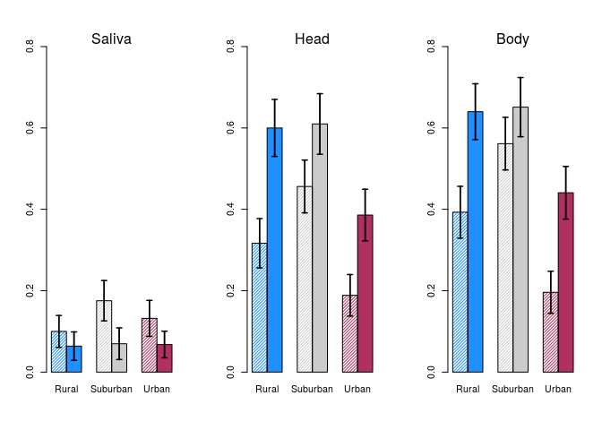<!-- -->

```r
#dev.off()
```

## Plots of Efficiency by Season


```r
effPlot <- function(rawTable){
  #format data
  tempLarge <- rawTable %>%
    filter(DPI=="21") %>%
    group_by(site,class) %>%
    mutate(bodyEff=mean(Body, na.rm=T))%>%
    ungroup() %>%
    filter(Body==1) %>%
    group_by(site,class) %>%
    mutate(headEff=mean(Head, na.rm=T))%>%
    ungroup() %>%
    filter(Head==1)%>%
    group_by(site,class) %>%
    mutate(salEff=mean(Saliva, na.rm=T))%>%
    select(site, class, bodyEff, headEff, salEff) %>%
    ungroup()
  tempLarge <- unique(tempLarge)
  #get mean and se
  temp <- tempLarge %>%
    select(-site) %>%
    group_by(class) %>%
    summarise_each(funs(mean(.,na.rm=T),se=(sd(., na.rm=T)/sqrt(n())))) %>%
    ungroup()
  
  tempMean <- as.matrix(temp[,2:4])
  rownames(tempMean) <- levels(temp$class)
  tempMean <- t(tempMean)
 
  colvec <- c(rep(colRural,3), rep(colSuburban,3), 
                            rep(colUrban,3))
  #plot
  barCenters <- barplot(tempMean, 
                      beside=T,
                      col=colvec,
                      density = c(20,60,NA),
                      names.arg=colnames(tempMean),
                      ylim=c(0,1),
                      ylab = "Relative Efficiency"
                      )

  tempSE <- as.matrix(temp[,5:7])
  
  tempSE <- t(tempSE)
  
  #add se bars
  segments(barCenters, tempMean - tempSE , barCenters,
         tempMean + tempSE, lwd = 1.5)
  
  arrows(barCenters, tempMean - tempSE , barCenters,
         tempMean + tempSE,
         lwd = 1.5, 
         angle = 90,
         code = 3, length = 0.03)
  
  #legend("topright", legend=c("9 dpi","14 dpi", "21 dpi"), density = c(10,40,NA),
       #bty = "n", col = "gray80")
}
```


```r
pdf(file="../figures/augEff.pdf", width = 8, height=4, family="sans")
effPlot(rawTable=august)
dev.off()

pdf(file="../figures/octEff.pdf", width = 8, height=4, family="sans")
effPlot(rawTable=oct)
dev.off()
```


# Statistical Analysis

Response Variable: Body, Head, and Saliva Infection Rates

Predictor Variables:

**Test 1**: Season & Land-Use

Based on the results of this, I want to know if this is in fact driven by microclimate:

**Test 2**: Microclimate (Temp and RH Variables)

Out of curiousity, also 

**Test 3**: Wing Length

And for a supplement, if we wanted to look at EIP rates:

**Test 4**: DPI

## Test 1: Season and Land-Use

I want to explore if season and land-use significantly influence infection dynamics. This will actually involve three tests (one each for body, head, saliva). I can then either a) test all DPI's at once with DPI as block factor (which may lead to strange results becuase of no 9 and 14 for october), or b) do each DPI seperately. I am currently going with the latter, which means I can only compare season for 21 dpi.

Using a Mixed-Effects Model with site as a random factor:

This [thread](https://stats.stackexchange.com/questions/134630/assessing-fit-of-binomial-glmer-in-r-with-only-categorical-predictors) has good info on how to assess accuracy of `glmer`.

So many examples (including some based on Bolker et al. 2009): http://glmm.wikidot.com/examples


```r
#this function is from https://ase.tufts.edu/gsc/gradresources/guidetomixedmodelsinr/mixed%20model%20guide.html

overdisp_fun <- function(model) {
    ## number of variance parameters in an n-by-n variance-covariance matrix
    vpars <- function(m) {
        nrow(m) * (nrow(m) + 1)/2
    }
    # The next two lines calculate the residual degrees of freedom
    model.df <- sum(sapply(VarCorr(model), vpars)) + length(fixef(model))
    rdf <- nrow(model.frame(model)) - model.df
    # extracts the Pearson residuals
    rp <- residuals(model, type = "pearson")
    Pearson.chisq <- sum(rp^2)
    prat <- Pearson.chisq/rdf
    # Generates a p-value. If less than 0.05, the data are overdispersed.
    pval <- pchisq(Pearson.chisq, df = rdf, lower.tail = FALSE)
    c(chisq = Pearson.chisq, ratio = prat, rdf = rdf, p = pval)
}
```

I could make a function to do all this, but it is better to look at each individually.

### August 9 DPI


```r
#check out data 
# ggplot(data=august[august$DPI=="9",], aes(factor(class))) +
#   geom_bar(stat="identity",aes(y=Body)) +
#   ggtitle("August 9 dpi Body")
#pdf? We know is binomial becuase it is binary
#nbinom <- fitdistr(august$Body[august$DPI=="9"], "Negative Binomial")
#qqp(august$Body[august$DPI=="9"], "nbinom", size=nbinom$estimate[[1]], mu = nbinom$estimate[[2]])
mixModelAugBody9 <- lme4::glmer(Body~class + (1|site), 
                          data=august[august$DPI=="9",],
                          family=binomial)
#get a summary
summary(mixModelAugBody9)
```

```
## Generalized linear mixed model fit by maximum likelihood (Laplace
##   Approximation) [glmerMod]
##  Family: binomial  ( logit )
## Formula: Body ~ class + (1 | site)
##    Data: august[august$DPI == "9", ]
## 
##      AIC      BIC   logLik deviance df.resid 
##    149.9    162.7    -71.0    141.9      174 
## 
## Scaled residuals: 
##     Min      1Q  Median      3Q     Max 
## -0.5552 -0.4225 -0.3444 -0.2728  2.9832 
## 
## Random effects:
##  Groups Name        Variance Std.Dev.
##  site   (Intercept) 0.4149   0.6441  
## Number of obs: 178, groups:  site, 9
## 
## Fixed effects:
##               Estimate Std. Error z value Pr(>|z|)    
## (Intercept)    -2.0228     0.5625  -3.596 0.000323 ***
## classSuburban   0.3117     0.7531   0.414 0.678967    
## classUrban     -0.1547     0.7831  -0.198 0.843419    
## ---
## Signif. codes:  0 '***' 0.001 '**' 0.01 '*' 0.05 '.' 0.1 ' ' 1
## 
## Correlation of Fixed Effects:
##             (Intr) clssSb
## classSubrbn -0.714       
## classUrban  -0.665  0.500
```

```r
#check significance
Anova(mixModelAugBody9) 
```

```
## Analysis of Deviance Table (Type II Wald chisquare tests)
## 
## Response: Body
##        Chisq Df Pr(>Chisq)
## class 0.3897  2      0.823
```

```r
#check overdispersion
overdisp_fun(mixModelAugBody9) #it's okay!
```

```
##       chisq       ratio         rdf           p 
## 151.2583871   0.8693011 174.0000000   0.8926038
```

```r
plot(mixModelAugBody9)
```

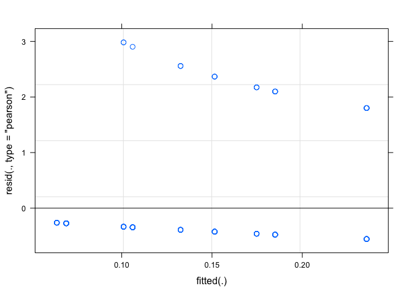<!-- -->


```r
#explore data
# ggplot(data=august[august$DPI=="9",], aes(factor(class))) +
#   geom_bar(stat="identity",aes(y=Head)) +
#   ggtitle("August 9 dpi Head")
#model
mixModelAugHead9 <- lme4::glmer(Head~class + (1|site), 
                          data=august[august$DPI=="9",],
                          family=binomial)
#get a summary
summary(mixModelAugHead9)
```

```
## Generalized linear mixed model fit by maximum likelihood (Laplace
##   Approximation) [glmerMod]
##  Family: binomial  ( logit )
## Formula: Head ~ class + (1 | site)
##    Data: august[august$DPI == "9", ]
## 
##      AIC      BIC   logLik deviance df.resid 
##     73.2     86.0    -32.6     65.2      176 
## 
## Scaled residuals: 
##     Min      1Q  Median      3Q     Max 
## -0.2294 -0.2294 -0.2294 -0.1857  5.3852 
## 
## Random effects:
##  Groups Name        Variance Std.Dev.
##  site   (Intercept) 4e-14    2e-07   
## Number of obs: 180, groups:  site, 9
## 
## Fixed effects:
##                 Estimate Std. Error z value Pr(>|z|)    
## (Intercept)   -2.944e+00  5.923e-01  -4.971 6.67e-07 ***
## classSuburban -4.229e-01  9.317e-01  -0.454     0.65    
## classUrban     1.628e-14  8.377e-01   0.000     1.00    
## ---
## Signif. codes:  0 '***' 0.001 '**' 0.01 '*' 0.05 '.' 0.1 ' ' 1
## 
## Correlation of Fixed Effects:
##             (Intr) clssSb
## classSubrbn -0.636       
## classUrban  -0.707  0.450
```

```r
#check significance
Anova(mixModelAugHead9) 
```

```
## Analysis of Deviance Table (Type II Wald chisquare tests)
## 
## Response: Head
##        Chisq Df Pr(>Chisq)
## class 0.2581  2     0.8789
```

```r
#check overdispersion
overdisp_fun(mixModelAugHead9) 
```

```
##      chisq      ratio        rdf          p 
## 180.000000   1.022727 176.000000   0.402422
```

There was no saliva infections at 9 dpi, so not even running a test on that.

The above code runs a mixed model on body and head infection in August at 9 dpi with site as a random factor. There is **no significant effect of class on body or head infection in August trial 9 dpi**.

### August 14 DPI


```r
#explore data
# ggplot(data=august[august$DPI=="14",], aes(factor(class))) +
#   geom_bar(stat="identity",aes(y=Body)) +
#   ggtitle("August 14 dpi Body")
#model
mixModelAugBody14 <- lme4::glmer(Body~class + (1|site), 
                          data=august[august$DPI=="14",],
                          family=binomial)
#get a summary
summary(mixModelAugBody14)
```

```
## Generalized linear mixed model fit by maximum likelihood (Laplace
##   Approximation) [glmerMod]
##  Family: binomial  ( logit )
## Formula: Body ~ class + (1 | site)
##    Data: august[august$DPI == "14", ]
## 
##      AIC      BIC   logLik deviance df.resid 
##    190.2    202.9    -91.1    182.2      172 
## 
## Scaled residuals: 
##     Min      1Q  Median      3Q     Max 
## -0.6602 -0.5230 -0.4209 -0.4184  2.3903 
## 
## Random effects:
##  Groups Name        Variance Std.Dev.
##  site   (Intercept) 0.006192 0.07869 
## Number of obs: 176, groups:  site, 9
## 
## Fixed effects:
##               Estimate Std. Error z value Pr(>|z|)    
## (Intercept)    -1.7367     0.3671  -4.731 2.24e-06 ***
## classSuburban   0.4360     0.4912   0.887   0.3748    
## classUrban      0.8882     0.4634   1.917   0.0553 .  
## ---
## Signif. codes:  0 '***' 0.001 '**' 0.01 '*' 0.05 '.' 0.1 ' ' 1
## 
## Correlation of Fixed Effects:
##             (Intr) clssSb
## classSubrbn -0.740       
## classUrban  -0.785  0.585
```

```r
#check significance
Anova(mixModelAugBody14) 
```

```
## Analysis of Deviance Table (Type II Wald chisquare tests)
## 
## Response: Body
##       Chisq Df Pr(>Chisq)
## class 3.757  2     0.1528
```

```r
#check overdispersion
overdisp_fun(mixModelAugBody14) 
```

```
##       chisq       ratio         rdf           p 
## 175.6184943   1.0210378 172.0000000   0.4091872
```

This is approaching signficance, with Urban mosquitoes more likely to be infected (0.888, p=0.0553).


```r
#explore data
# ggplot(data=august[august$DPI=="14",], aes(factor(class))) +
#   geom_bar(stat="identity",aes(y=Head)) +
#   ggtitle("August 14 dpi Head")
#model
mixModelAugHead14 <- lme4::glmer(Head~class + (1|site), 
                          data=august[august$DPI=="14",],
                          family=binomial)
#get a summary
summary(mixModelAugHead14)
```

```
## Generalized linear mixed model fit by maximum likelihood (Laplace
##   Approximation) [glmerMod]
##  Family: binomial  ( logit )
## Formula: Head ~ class + (1 | site)
##    Data: august[august$DPI == "14", ]
## 
##      AIC      BIC   logLik deviance df.resid 
##    170.4    183.1    -81.2    162.4      172 
## 
## Scaled residuals: 
##     Min      1Q  Median      3Q     Max 
## -0.5517 -0.5517 -0.5222 -0.3333  3.0000 
## 
## Random effects:
##  Groups Name        Variance Std.Dev.
##  site   (Intercept) 0        0       
## Number of obs: 176, groups:  site, 9
## 
## Fixed effects:
##               Estimate Std. Error z value Pr(>|z|)    
## (Intercept)    -2.1972     0.4303  -5.106 3.29e-07 ***
## classSuburban   0.8979     0.5397   1.664   0.0961 .  
## classUrban      1.0076     0.5276   1.910   0.0561 .  
## ---
## Signif. codes:  0 '***' 0.001 '**' 0.01 '*' 0.05 '.' 0.1 ' ' 1
## 
## Correlation of Fixed Effects:
##             (Intr) clssSb
## classSubrbn -0.797       
## classUrban  -0.816  0.650
```

```r
#check significance
Anova(mixModelAugHead14) 
```

```
## Analysis of Deviance Table (Type II Wald chisquare tests)
## 
## Response: Head
##        Chisq Df Pr(>Chisq)
## class 3.9559  2     0.1384
```

```r
#check overdispersion
overdisp_fun(mixModelAugHead14) 
```

```
##       chisq       ratio         rdf           p 
## 176.0000000   1.0232558 172.0000000   0.4013319
```

As above, head infection is close to significance, with urban more likely than rural, but suburban and urban very similar.


```r
#explore data
# ggplot(data=august[august$DPI=="14",], aes(factor(class))) +
#   geom_bar(stat="identity",aes(y=Saliva)) + 
#   ggtitle("August 14 dpi Saliva")
#model
mixModelAugSaliva14 <- lme4::glmer(Saliva~class + (1|site), 
                          data=august[august$DPI=="14",],
                          family=binomial)
#get a summary
summary(mixModelAugSaliva14)
```

```
## Generalized linear mixed model fit by maximum likelihood (Laplace
##   Approximation) [glmerMod]
##  Family: binomial  ( logit )
## Formula: Saliva ~ class + (1 | site)
##    Data: august[august$DPI == "14", ]
## 
##      AIC      BIC   logLik deviance df.resid 
##     77.9     90.5    -34.9     69.9      171 
## 
## Scaled residuals: 
##     Min      1Q  Median      3Q     Max 
## -0.3258 -0.2451 -0.2192 -0.1631  4.8304 
## 
## Random effects:
##  Groups Name        Variance Std.Dev.
##  site   (Intercept) 0.2858   0.5346  
## Number of obs: 175, groups:  site, 9
## 
## Fixed effects:
##               Estimate Std. Error z value Pr(>|z|)    
## (Intercept)    -3.4865     0.8602  -4.053 5.06e-05 ***
## classSuburban   0.8247     1.0064   0.819    0.413    
## classUrban      0.4269     1.0454   0.408    0.683    
## ---
## Signif. codes:  0 '***' 0.001 '**' 0.01 '*' 0.05 '.' 0.1 ' ' 1
## 
## Correlation of Fixed Effects:
##             (Intr) clssSb
## classSubrbn -0.761       
## classUrban  -0.728  0.604
```

```r
#check significance
Anova(mixModelAugSaliva14) 
```

```
## Analysis of Deviance Table (Type II Wald chisquare tests)
## 
## Response: Saliva
##        Chisq Df Pr(>Chisq)
## class 0.6833  2     0.7106
```

```r
#check overdispersion
overdisp_fun(mixModelAugSaliva14) 
```

```
##       chisq       ratio         rdf           p 
## 152.5602161   0.8921650 171.0000000   0.8411014
```

No difference in Saliva.

**At 9 and 14 dpi, there is no significant effect of class on the infection dynamics. Based on this, I am choosing to only focus on the 21 dpi for future statistical tests.**

### Season x Class 21 DPI


```r
#explore data
ggplot(data=seasons[seasons$DPI=="21",], aes(factor(class))) +
  geom_bar(stat="identity",aes(y=Body)) +
  facet_wrap(~block) + 
  ggtitle("21 dpi Body across Seasons")
```

```
## Warning: Removed 18 rows containing missing values (position_stack).
```

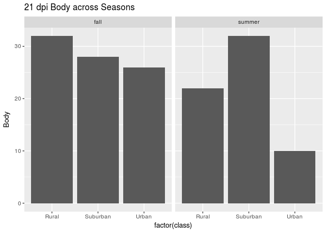<!-- -->

```r
#model
mixModelseasonsBody21 <- lme4::glmer(Body~class + block + block*class + (1|site), 
                          data=seasons[seasons$DPI=="21",],
                          family=binomial(link="logit"))
#get a summary
summary(mixModelseasonsBody21)
```

```
## Generalized linear mixed model fit by maximum likelihood (Laplace
##   Approximation) [glmerMod]
##  Family: binomial  ( logit )
## Formula: Body ~ class + block + block * class + (1 | site)
##    Data: seasons[seasons$DPI == "21", ]
## 
##      AIC      BIC   logLik deviance df.resid 
##    419.6    445.9   -202.8    405.6      309 
## 
## Scaled residuals: 
##     Min      1Q  Median      3Q     Max 
## -1.3663 -0.8876 -0.4939  0.8839  2.0248 
## 
## Random effects:
##  Groups Name        Variance Std.Dev.
##  site   (Intercept) 0        0       
## Number of obs: 316, groups:  site, 9
## 
## Fixed effects:
##                           Estimate Std. Error z value Pr(>|z|)  
## (Intercept)                0.57536    0.29463   1.953   0.0508 .
## classSuburban              0.04879    0.43496   0.112   0.9107  
## classUrban                -0.81378    0.39442  -2.063   0.0391 *
## blocksummer               -1.01068    0.40208  -2.514   0.0120 *
## classSuburban:blocksummer  0.63339    0.57906   1.094   0.2740  
## classUrban:blocksummer    -0.16189    0.59567  -0.272   0.7858  
## ---
## Signif. codes:  0 '***' 0.001 '**' 0.01 '*' 0.05 '.' 0.1 ' ' 1
## 
## Correlation of Fixed Effects:
##             (Intr) clssSb clssUr blcksm clssS:
## classSubrbn -0.677                            
## classUrban  -0.747  0.506                     
## blocksummer -0.733  0.496  0.547              
## clssSbrbn:b  0.509 -0.751 -0.380 -0.694       
## clssUrbn:bl  0.495 -0.335 -0.662 -0.675  0.469
```

```r
#check significance
Anova(mixModelseasonsBody21) 
```

```
## Analysis of Deviance Table (Type II Wald chisquare tests)
## 
## Response: Body
##               Chisq Df Pr(>Chisq)    
## class       18.1680  2  0.0001135 ***
## block       12.2712  1  0.0004600 ***
## class:block  1.9851  2  0.3706257    
## ---
## Signif. codes:  0 '***' 0.001 '**' 0.01 '*' 0.05 '.' 0.1 ' ' 1
```

```r
#check overdispersion
overdisp_fun(mixModelseasonsBody21) 
```

```
##       chisq       ratio         rdf           p 
## 315.9999988   1.0226537 309.0000000   0.3797057
```

```r
plot(mixModelseasonsBody21)
```

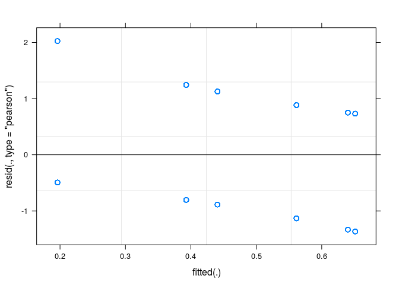<!-- -->

```r
#Predict onto real data and compare
# test21 <- predict(mixModelseasonsBody21, data=seasons[seasons$DPI=="21",])
# plot(y=seasons[as.numeric(names(test21)), 'Body'], x=test21, 
#      col=c(colR,colS, colU)[as.numeric(seasons[as.numeric(names(test21)), 'class'])],
#      pch=c(15,17)[as.numeric(seasons[as.numeric(names(test21)), 'block'])],
#      xlab="Model Predictions",
#      ylab="Observed Values")
```

We find that class and block have a significant effect on Body infection at 21 days, but there is no interaction between the two.


```r
#explore data
ggplot(data=seasons[seasons$DPI=="21",], aes(factor(class))) +
  geom_bar(stat="identity",aes(y=Head)) +
  facet_wrap(~block) +
  ggtitle("21 dpi Head Across Seasons")
```

```
## Warning: Removed 16 rows containing missing values (position_stack).
```

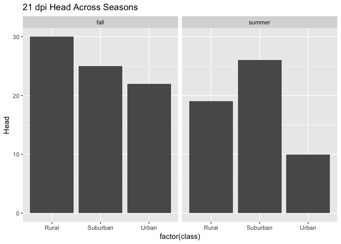<!-- -->

```r
#model
mixModelseasonsHead21 <- lme4::glmer(Head~class + block + block*class + (1|site), 
                          data=seasons[seasons$DPI=="21",],
                          family=binomial(link="logit"))
#get a summary
summary(mixModelseasonsHead21)
```

```
## Generalized linear mixed model fit by maximum likelihood (Laplace
##   Approximation) [glmerMod]
##  Family: binomial  ( logit )
## Formula: Head ~ class + block + block * class + (1 | site)
##    Data: seasons[seasons$DPI == "21", ]
## 
##      AIC      BIC   logLik deviance df.resid 
##    417.0    443.3   -201.5    403.0      311 
## 
## Scaled residuals: 
##     Min      1Q  Median      3Q     Max 
## -1.2500 -0.7928 -0.4822  0.8165  2.0736 
## 
## Random effects:
##  Groups Name        Variance  Std.Dev. 
##  site   (Intercept) 2.543e-14 1.595e-07
## Number of obs: 318, groups:  site, 9
## 
## Fixed effects:
##                           Estimate Std. Error z value Pr(>|z|)   
## (Intercept)                0.40547    0.28868   1.405  0.16015   
## classSuburban              0.04082    0.43108   0.095  0.92456   
## classUrban                -0.86977    0.39669  -2.193  0.02834 * 
## blocksummer               -1.17460    0.40044  -2.933  0.00335 **
## classSuburban:blocksummer  0.55242    0.57756   0.956  0.33883   
## classUrban:blocksummer     0.18029    0.59803   0.302  0.76306   
## ---
## Signif. codes:  0 '***' 0.001 '**' 0.01 '*' 0.05 '.' 0.1 ' ' 1
## 
## Correlation of Fixed Effects:
##             (Intr) clssSb clssUr blcksm clssS:
## classSubrbn -0.670                            
## classUrban  -0.728  0.487                     
## blocksummer -0.721  0.483  0.525              
## clssSbrbn:b  0.500 -0.746 -0.364 -0.693       
## clssUrbn:bl  0.483 -0.323 -0.663 -0.670  0.464
```

```r
#check significance
Anova(mixModelseasonsHead21) 
```

```
## Analysis of Deviance Table (Type II Wald chisquare tests)
## 
## Response: Head
##               Chisq Df Pr(>Chisq)    
## class       14.2528  2  0.0008036 ***
## block       14.9093  1  0.0001128 ***
## class:block  0.9408  2  0.6247611    
## ---
## Signif. codes:  0 '***' 0.001 '**' 0.01 '*' 0.05 '.' 0.1 ' ' 1
```

```r
#check overdispersion
overdisp_fun(mixModelseasonsHead21) 
```

```
##      chisq      ratio        rdf          p 
## 318.000000   1.022508 311.000000   0.380076
```

Again, there is a significant effect of class and block, but no interaction. Similar effects as with the body infections.


```r
#explore data
ggplot(data=seasons[seasons$DPI=="21",], aes(factor(class))) +
  geom_bar(stat="identity",aes(y=Saliva)) +
  facet_wrap(~block) + 
  ggtitle("21 dpi Saliva across Seasons")
```

```
## Warning: Removed 15 rows containing missing values (position_stack).
```

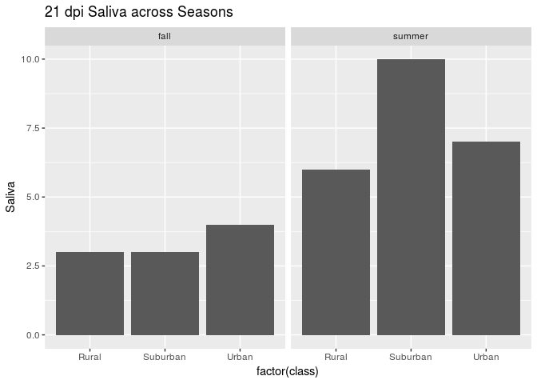<!-- -->

```r
#model
mixModelseasonsSaliva21 <- lme4::glmer(Saliva~class + block + block*class + (1|site), 
                          data=seasons[seasons$DPI=="21",],
                          family=binomial(link="logit"))
#get a summary
summary(mixModelseasonsSaliva21)
```

```
## Generalized linear mixed model fit by maximum likelihood (Laplace
##   Approximation) [glmerMod]
##  Family: binomial  ( logit )
## Formula: Saliva ~ class + block + block * class + (1 | site)
##    Data: seasons[seasons$DPI == "21", ]
## 
##      AIC      BIC   logLik deviance df.resid 
##    220.7    247.0   -103.3    206.7      312 
## 
## Scaled residuals: 
##     Min      1Q  Median      3Q     Max 
## -0.4618 -0.3899 -0.2741 -0.2695  3.8307 
## 
## Random effects:
##  Groups Name        Variance  Std.Dev.
##  site   (Intercept) 0.0006551 0.0256  
## Number of obs: 319, groups:  site, 9
## 
## Fixed effects:
##                           Estimate Std. Error z value Pr(>|z|)    
## (Intercept)               -2.68591    0.60090  -4.470 7.83e-06 ***
## classSuburban              0.09513    0.84638   0.112    0.911    
## classUrban                 0.06458    0.79043   0.082    0.935    
## blocksummer                0.48842    0.73587   0.664    0.507    
## classSuburban:blocksummer  0.55471    1.01309   0.548    0.584    
## classUrban:blocksummer     0.24984    0.98722   0.253    0.800    
## ---
## Signif. codes:  0 '***' 0.001 '**' 0.01 '*' 0.05 '.' 0.1 ' ' 1
## 
## Correlation of Fixed Effects:
##             (Intr) clssSb clssUr blcksm clssS:
## classSubrbn -0.695                            
## classUrban  -0.751  0.532                     
## blocksummer -0.808  0.571  0.612              
## clssSbrbn:b  0.577 -0.837 -0.444 -0.725       
## clssUrbn:bl  0.603 -0.425 -0.800 -0.746  0.539
```

```r
#check significance
Anova(mixModelseasonsSaliva21)
```

```
## Analysis of Deviance Table (Type II Wald chisquare tests)
## 
## Response: Saliva
##              Chisq Df Pr(>Chisq)  
## class       1.1055  2    0.57538  
## block       3.6297  1    0.05676 .
## class:block 0.3023  2    0.85971  
## ---
## Signif. codes:  0 '***' 0.001 '**' 0.01 '*' 0.05 '.' 0.1 ' ' 1
```

```r
#check overdispersion
overdisp_fun(mixModelseasonsSaliva21) 
```

```
##       chisq       ratio         rdf           p 
## 318.9191001   1.0221766 312.0000000   0.3814757
```

There is **no significant effect on saliva**. There is almost (p=0.056) an effect of block, but not quite.

## Test 2: Microclimate

Based on the results of Test 1, we only see a difference in infection at 21 dpi sampling time point, so this is all we will use in our microclimate tests.

### Load and Format Microclimate Data


```r
climate <- read.csv('../../data/microclimate/clean/2016TrialsAdult.csv')[,-1]
#toss out ridiculous levels
climate <- climate[climate$Temp<75,]
#format date
climate$Date <- strptime(climate$Date, format="%Y-%m-%d %H:%M:%S")
#draw out day
climate$Day <- as.Date(climate$Date)

# add tray id to climate data
trayID <- read.csv("../../data/microclimate/trayLoggerID.csv") #read in IDs
climate <- merge(climate, trayID, by="Pot_ID")

#fix duplicates for R1T1
climate <- unique(climate)

#U2T2 and U1T2 are missing data
range(climate[climate$Tray_ID=="U2T2", 'Date']) 
```

```
## [1] "2016-08-01 17:04:48 EDT" "2016-08-05 09:14:48 EDT"
```

```r
range(climate[climate$Tray_ID=="U1T2", 'Date']) 
```

```
## [1] "2016-08-01 17:07:27 EDT" "2016-11-07 16:51:04 EST"
```

```r
#drop U2T2 becuase it only has data until August 5th
inds <- which(climate$Tray_ID=="U2T2")
climate <- climate[-inds,]
rm(inds)

#U2T4 wasn't working right, reporting temps above 40C in October
inds <- which(climate$Tray_ID=="U2T4")
climate <- climate[-inds,]
rm(inds)
```

We need to correct these for the days when mosquitoes were actually collected, and the number of mosquitoes from each tray.


```r
augEmerg <- read.csv("../../data/emergence/raw/AugustEmergence.csv")
augEmerg$block <- as.factor("summer")
octEmerg <- read.csv("../../data/emergence/raw/OctoberEmergence.csv")
octEmerg$block <- as.factor("fall")

allEmerg <- rbind(augEmerg, octEmerg)
```


```r
#filter out only days when infected mosquitoes were in the trays
octInf <- octEmerg %>%
  filter(Sex=="F") %>%
  filter((Site_Code %in% c("U3", "R3") & Day <= 21) |
           (Site_Code %in% c("U2", "U1", "S3") & Day <= 20) |
           (Site_Code %in% c("S1", "S2", "R1", "R2") & Day <= 24))

augInf <- augEmerg %>%
  filter(Sex=="F") %>%
    filter((Site_Code %in% c("U2", "U1", "S3", "R1") & Day <= 14) |
           (Site_Code %in% c("S1", "S2", "R2", "R3", "U3") & Day <= 17))
```


```r
detach("package:plyr", unload=TRUE)
```

```
## Warning: 'plyr' namespace cannot be unloaded:
##   namespace 'plyr' is imported by 'scales', 'ggplot2', 'reshape2', 'caret', 'pROC' so cannot be unloaded
```

```r
octClim <- climate %>%
  dplyr::select(-Date) %>%
  filter(Day >= as.Date("2016-09-26","%Y-%m-%d")) %>%
  #filter out appropriate days
  filter((Site_ID %in% c("U3", "R3") & Day <= "2016-10-21") |
           (Site_ID %in% c("U2", "U1", "S3") & Day <= "2016-10-20") |
           (Site_ID %in% c("S1", "S2", "R1", "R2") & Day <= "2016-10-24")) %>%
  dplyr::select(-Site_ID, -Pot_ID, -Class) %>%
  #get daily averages by Tray
  group_by(Tray_ID, Day) %>%
  summarise_each(funs(mean(., na.rm=T), min(., na.rm=T), max(., na.rm=T))) %>%
  #calculate DTR
  mutate(DTR=Temp_max-Temp_min) %>%
  #get overall average over study period per tray (average daily values)
  ungroup() %>%
  dplyr::select(-Day) %>%
  group_by(Tray_ID) %>%
  summarise_each(funs(mean))

#calculate hours above a set Tmax and below a set Tmin based on Mordecai et al min and max r0, min=16C, max= 31 C

#calculate percent of time above and below temperatures
octBelow16 <- climate %>%
  dplyr::select(-Date) %>%
  filter(Day >= as.Date("2016-09-26","%Y-%m-%d")) %>%
  #filter out appropriate days
  filter((Site_ID %in% c("U3", "R3") & Day <= "2016-10-21") |
           (Site_ID %in% c("U2", "U1", "S3") & Day <= "2016-10-20") |
           (Site_ID %in% c("S1", "S2", "R1", "R2") & Day <= "2016-10-24")) %>%
  filter(Temp<16) %>%
  group_by(Tray_ID) %>%
  dplyr::summarise(Tcount=n()) %>%
  mutate(hoursBelow16=Tcount/6) %>%
  select(-Tcount)


octAbove31 <- climate %>%
  dplyr::select(-Date) %>%
  filter(Day >= as.Date("2016-09-26","%Y-%m-%d")) %>%
  #filter out appropriate days
  filter((Site_ID %in% c("U3", "R3") & Day <= "2016-10-21") |
           (Site_ID %in% c("U2", "U1", "S3") & Day <= "2016-10-20") |
           (Site_ID %in% c("S1", "S2", "R1", "R2") & Day <= "2016-10-24")) %>%
  filter(Temp>31) %>%
  group_by(Tray_ID) %>%
  summarise(Tcount=n()) %>%
  mutate(hoursAbove31=Tcount/6) %>%
  select(-Tcount)


#merge climate variables together
octClim <- merge(octClim, octBelow16, by="Tray_ID", all.x=T)
octClim <- merge(octClim, octAbove31, by="Tray_ID", all.x=T)

#add 0s
octClim$hoursAbove31[is.na(octClim$hoursAbove31)] <- 0
octClim$hoursBelow16[is.na(octClim$hoursBelow16)] <- 0


#merge climate and infection data
test <- merge(octInf, octClim, by.x="Tray_Code", by.y="Tray_ID", all.x=T)

#replace missing tray data with mean of the site values
meanU2 <- test %>%
  filter(Site_Code=="U2") %>%
  summarise_each(funs(mean(.,na.rm=T)), Temp_mean:hoursAbove31)
missingInds <- which(is.na(test$Temp_mean))
test[missingInds, 12:ncol(test)] <- meanU2

#weight contribution of each tray based on how many mosquitoes emerged from it that were infected

#function multiplies value by number of mosquitoes emerged
emergWeight <- function(envVar, noEmerg){
  newVal <- envVar * noEmerg
  return(newVal)
}

#function that divides by the total emerged per site
cumDivide <- function(envVar, cumul){
  newVal <- sum(envVar)/cumul
  return(newVal)
}

octEnvVar <- test %>%
  dplyr::select(-Tray_Code,-Site, -Tray, - Class, - Month, - Day, - Exp_Day, - Sex) %>%
  rowwise() %>%
  #multiply by number per tray
  mutate_each(funs(emergWeight(., Num_Emerge)), -Site_Code, -block) %>%
  group_by(Site_Code, block) %>%
  #sum and divide by cumulative emergence
  mutate(cumEmerge = sum(Num_Emerge)) %>%
  mutate_each(funs(cumDivide(.,cumEmerge)), -Site_Code, -block) %>%
  ungroup() %>%
  dplyr::select(-cumEmerge, -Num_Emerge) %>%
  #get unique values per site
  distinct(Site_Code, .keep_all=T)
```

```
## Warning: Grouping rowwise data frame strips rowwise nature
```

```r
rm(test) #clear unused temporary dataframe
```


```r
##repeat above for August
augClim <- climate %>%
  dplyr::select(-Date) %>%
  filter(Day >= as.Date("2016-08-01","%Y-%m-%d")) %>%
    filter((Site_ID %in% c("U2", "U1", "S3", "R1") & Day <= "2016-08-14") |
           (Site_ID %in% c("S1", "S2", "R2", "R3", "U3") & Day <= "2016-08-17")) %>%
  dplyr::select(-Site_ID, -Pot_ID, -Class) %>%
  #get daily averages by Tray
  group_by(Tray_ID, Day) %>%
  summarise_each(funs(mean(., na.rm=T), min(., na.rm=T), max(., na.rm=T))) %>%
  #calculate DTR
  mutate(DTR=Temp_max-Temp_min) %>%
  #get overall average over study period per tray (average daily values)
  ungroup() %>%
  dplyr::select(-Day) %>%
  group_by(Tray_ID) %>%
  summarise_each(funs(mean))

#calculate hours above a set Tmax and below a set Tmin based on Mordecai et al min and max r0, min=16C, max= 31 C

#calculate number of hours above and below temperatures
#there are no hours below 16 in august
# augBelow16 <- climate %>%
#   dplyr::select(-Date) %>%
#   filter(Day >= as.Date("2016-08-01","%Y-%m-%d")) %>%
#     filter((Site_ID %in% c("U2", "U1", "S3", "R1") & Day <= "2016-08-14") |
#            (Site_ID %in% c("S1", "S2", "R2", "R3", "U3") & Day <= "2016-08-17")) %>%
#   filter(Temp<16) %>%
#   group_by(Tray_ID) %>%
#   summarise(Tcount=n()) %>%
#   mutate(hoursBelow16=Tcount/6) %>%
#   select(-Tcount)

augAbove31 <- climate %>%
  dplyr::select(-Date) %>%
  filter(Day >= as.Date("2016-08-01","%Y-%m-%d")) %>%
  filter((Site_ID %in% c("U2", "U1", "S3", "R1") & Day <= "2016-08-14") |
           (Site_ID %in% c("S1", "S2", "R2", "R3", "U3") & Day <= "2016-08-17")) %>%
  filter(Temp>31) %>%
  group_by(Tray_ID) %>%
  dplyr::summarise(Tcount=n()) %>%
  mutate(hoursAbove31=Tcount/6) %>%
  select(-Tcount)


#merge climate variables together
augClim <- merge(augClim, augAbove31, by="Tray_ID", all.x=T)

#add 0s
augClim$hoursAbove31[is.na(augClim$hoursAbove31)] <- 0
augClim$hoursBelow16 <- 0

test <- merge(augInf, augClim, by.x="Tray_Code", by.y="Tray_ID")

#replace missing tray data with mean of the site values
meanU2 <- test %>%
  filter(Site_Code=="U2") %>%
  summarise_each(funs(mean(.,na.rm=T)), Temp_mean:hoursAbove31)
missingInds <- which(is.na(test$Temp_mean))
test[missingInds, 12:ncol(test)] <- meanU2

augEnvVar <- test %>%
  dplyr::select(-Tray_Code,-Site, -Tray, - Class, - Month, - Day, - Exp_Day, - Sex) %>%
  rowwise() %>%
  #multiply by number per tray
  mutate_each(funs(emergWeight(., Num_Emerge)), -Site_Code, -block) %>%
  group_by(Site_Code, block) %>%
  #sum and divide by cumulative emergence
  mutate(cumEmerge = sum(Num_Emerge)) %>%
  mutate_each(funs(cumDivide(.,cumEmerge)), -Site_Code, -block) %>%
  ungroup() %>%
  dplyr::select(-cumEmerge, -Num_Emerge) %>%
  #get unique values per site
  distinct(Site_Code, .keep_all=T)
```

```
## Warning: Grouping rowwise data frame strips rowwise nature
```


```r
#merge the summer and fall into one dataframe
oct$block <- as.factor("fall")
august$block <- as.factor("summer")
seasonInf <- merge(rbind(oct, august[august$DPI=="21",]), rbind(augEnvVar,octEnvVar), by.x=c("block", "site"), by.y=c("block", "Site_Code"))
```

This results in a dataframe `seasonInf` that has the infection status and environmental variables associated with each individual in both seasons.

### Stats

#### Visualization


```r
envVarPlot <- function(sample){
  
p1 <- ggplot(data=seasonInf, aes_string(x="Temp_mean", y=sample)) +
  geom_point(aes(color=class)) +
  geom_smooth() +
  theme(legend.position="none")

p2 <- ggplot(data=seasonInf, aes_string(x="Temp_max", y=sample)) +
  geom_point(aes(color=class)) +
  geom_smooth() +
  theme(legend.position="none")

p3 <- ggplot(data=seasonInf, aes_string(x="Temp_min", y=sample)) +
  geom_point(aes(color=class)) +
  geom_smooth() +
  theme(legend.position="none")

p4 <- ggplot(data=seasonInf, aes_string(x="RH_mean", y=sample)) +
  geom_point(aes(color=class)) +
  geom_smooth() +
  theme(legend.position="none")

p5 <- ggplot(data=seasonInf, aes_string(x="RH_max", y=sample)) +
  geom_point(aes(color=class)) +
  geom_smooth() +
  theme(legend.position="none")

p6 <- ggplot(data=seasonInf, aes_string(x="RH_min", y=sample)) +
  geom_point(aes(color=class)) +
  geom_smooth() +
  theme(legend.position="none")

p7 <- ggplot(data=seasonInf, aes_string(x="DTR", y=sample)) +
  geom_point(aes(color=class)) +
  geom_smooth() +
  theme(legend.position="none")

p8 <- ggplot(data=seasonInf, aes_string(x="hoursAbove31", y=sample)) +
  geom_point(aes(color=class)) +
  geom_smooth() +
  theme(legend.position="none")

p9 <- ggplot(data=seasonInf, aes_string(x="hoursBelow16", y=sample)) +
  geom_point(aes(color=class)) +
  geom_smooth()

plotAll <- grid.arrange(p1,p2,p3,p4,p5,p6,p7,p8,p9,nrow=3)
return(plotAll)
}
```


```r
envVarPlot("Body")
```

```
## Warning: Removed 18 rows containing non-finite values (stat_smooth).
```

```
## Warning: Removed 18 rows containing missing values (geom_point).
```

```
## Warning: Removed 18 rows containing non-finite values (stat_smooth).
```

```
## Warning: Removed 18 rows containing missing values (geom_point).
```

```
## Warning: Removed 18 rows containing non-finite values (stat_smooth).
```

```
## Warning: Removed 18 rows containing missing values (geom_point).
```

```
## Warning: Removed 18 rows containing non-finite values (stat_smooth).
```

```
## Warning: Removed 18 rows containing missing values (geom_point).
```

```
## Warning: Removed 18 rows containing non-finite values (stat_smooth).
```

```
## Warning: Removed 18 rows containing missing values (geom_point).
```

```
## Warning: Removed 18 rows containing non-finite values (stat_smooth).
```

```
## Warning: Removed 18 rows containing missing values (geom_point).
```

```
## Warning: Removed 18 rows containing non-finite values (stat_smooth).
```

```
## Warning: Removed 18 rows containing missing values (geom_point).
```

```
## Warning: Removed 18 rows containing non-finite values (stat_smooth).
```

```
## Warning: Removed 18 rows containing missing values (geom_point).
```

```
## Warning: Removed 18 rows containing non-finite values (stat_smooth).
```

```
## Warning: Removed 18 rows containing missing values (geom_point).
```

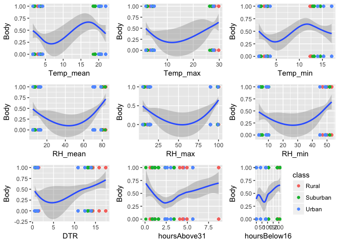<!-- -->

```
## TableGrob (3 x 3) "arrange": 9 grobs
##   z     cells    name           grob
## 1 1 (1-1,1-1) arrange gtable[layout]
## 2 2 (1-1,2-2) arrange gtable[layout]
## 3 3 (1-1,3-3) arrange gtable[layout]
## 4 4 (2-2,1-1) arrange gtable[layout]
## 5 5 (2-2,2-2) arrange gtable[layout]
## 6 6 (2-2,3-3) arrange gtable[layout]
## 7 7 (3-3,1-1) arrange gtable[layout]
## 8 8 (3-3,2-2) arrange gtable[layout]
## 9 9 (3-3,3-3) arrange gtable[layout]
```

```r
envVarPlot("Head")
```

```
## Warning: Removed 16 rows containing non-finite values (stat_smooth).
```

```
## Warning: Removed 16 rows containing missing values (geom_point).
```

```
## Warning: Removed 16 rows containing non-finite values (stat_smooth).
```

```
## Warning: Removed 16 rows containing missing values (geom_point).
```

```
## Warning: Removed 16 rows containing non-finite values (stat_smooth).
```

```
## Warning: Removed 16 rows containing missing values (geom_point).
```

```
## Warning: Removed 16 rows containing non-finite values (stat_smooth).
```

```
## Warning: Removed 16 rows containing missing values (geom_point).
```

```
## Warning: Removed 16 rows containing non-finite values (stat_smooth).
```

```
## Warning: Removed 16 rows containing missing values (geom_point).
```

```
## Warning: Removed 16 rows containing non-finite values (stat_smooth).
```

```
## Warning: Removed 16 rows containing missing values (geom_point).
```

```
## Warning: Removed 16 rows containing non-finite values (stat_smooth).
```

```
## Warning: Removed 16 rows containing missing values (geom_point).
```

```
## Warning: Removed 16 rows containing non-finite values (stat_smooth).
```

```
## Warning: Removed 16 rows containing missing values (geom_point).
```

```
## Warning: Removed 16 rows containing non-finite values (stat_smooth).
```

```
## Warning: Removed 16 rows containing missing values (geom_point).
```

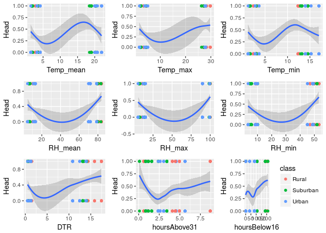<!-- -->

```
## TableGrob (3 x 3) "arrange": 9 grobs
##   z     cells    name           grob
## 1 1 (1-1,1-1) arrange gtable[layout]
## 2 2 (1-1,2-2) arrange gtable[layout]
## 3 3 (1-1,3-3) arrange gtable[layout]
## 4 4 (2-2,1-1) arrange gtable[layout]
## 5 5 (2-2,2-2) arrange gtable[layout]
## 6 6 (2-2,3-3) arrange gtable[layout]
## 7 7 (3-3,1-1) arrange gtable[layout]
## 8 8 (3-3,2-2) arrange gtable[layout]
## 9 9 (3-3,3-3) arrange gtable[layout]
```

```r
envVarPlot("Saliva")
```

```
## Warning: Removed 15 rows containing non-finite values (stat_smooth).
```

```
## Warning: Removed 15 rows containing missing values (geom_point).
```

```
## Warning: Removed 15 rows containing non-finite values (stat_smooth).
```

```
## Warning: Removed 15 rows containing missing values (geom_point).
```

```
## Warning: Removed 15 rows containing non-finite values (stat_smooth).
```

```
## Warning: Removed 15 rows containing missing values (geom_point).
```

```
## Warning: Removed 15 rows containing non-finite values (stat_smooth).
```

```
## Warning: Removed 15 rows containing missing values (geom_point).
```

```
## Warning: Removed 15 rows containing non-finite values (stat_smooth).
```

```
## Warning: Removed 15 rows containing missing values (geom_point).
```

```
## Warning: Removed 15 rows containing non-finite values (stat_smooth).
```

```
## Warning: Removed 15 rows containing missing values (geom_point).
```

```
## Warning: Removed 15 rows containing non-finite values (stat_smooth).
```

```
## Warning: Removed 15 rows containing missing values (geom_point).
```

```
## Warning: Removed 15 rows containing non-finite values (stat_smooth).
```

```
## Warning: Removed 15 rows containing missing values (geom_point).
```

```
## Warning: Removed 15 rows containing non-finite values (stat_smooth).
```

```
## Warning: Removed 15 rows containing missing values (geom_point).
```

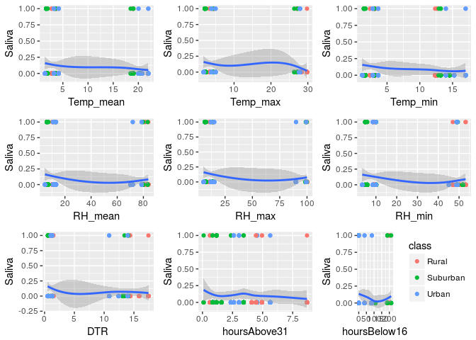<!-- -->

```
## TableGrob (3 x 3) "arrange": 9 grobs
##   z     cells    name           grob
## 1 1 (1-1,1-1) arrange gtable[layout]
## 2 2 (1-1,2-2) arrange gtable[layout]
## 3 3 (1-1,3-3) arrange gtable[layout]
## 4 4 (2-2,1-1) arrange gtable[layout]
## 5 5 (2-2,2-2) arrange gtable[layout]
## 6 6 (2-2,3-3) arrange gtable[layout]
## 7 7 (3-3,1-1) arrange gtable[layout]
## 8 8 (3-3,2-2) arrange gtable[layout]
## 9 9 (3-3,3-3) arrange gtable[layout]
```

There doesn't seem to be much of an effect of any of them on saliva infection, but all the temperature variables seem to have a similar effect, and the RH variables an inverse (which makes sense). RH max is super weird because most of them have 100, so I will not use it in the glmer model.

We can also check out some collinearity and correlations.


```r
envVars <- seasonInf[,10:ncol(seasonInf)]
corrplot(cor(envVars))
```

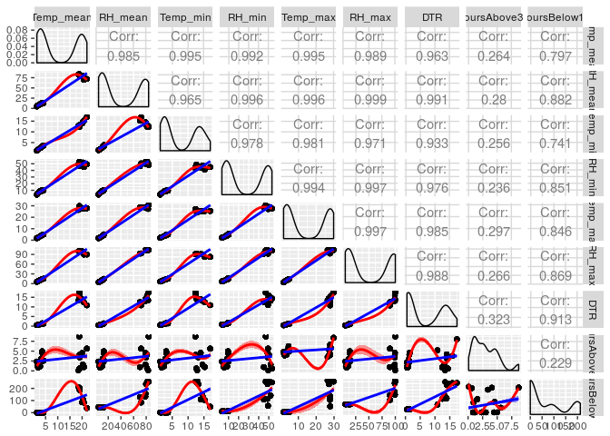<!-- -->

```r
#pairs(envVars)
```


#### GBM

Because the response is binary, I'm going to give it a shot using glmnet and GBM. Also, there is no longer a random effect of site because the environmental variables are aggregated by site.


```r
respV <- "Body"
predVs <- c("Temp_mean","RH_mean","Temp_min","RH_min", "Temp_max", "DTR", "hoursAbove31", "hoursBelow16")

prop.table(table(seasonInf[,respV])) #need at least %15 infected for easier stats
```

```
## 
##         0         1 
## 0.5253165 0.4746835
```

```r
#create dataframe without NAs
myCols <- c(respV, predVs)
modDF <- seasonInf %>%
  dplyr::select(one_of(myCols)) 
modDF <- na.omit(modDF)
modDF[,respV] <- as.factor(modDF[,respV])
levels(modDF[,respV]) <- c("no", "yes")


#split into testing and training
set.seed(8675309)
inds <- createDataPartition(modDF[,respV], p=.7, list=F, times=1)
train <- modDF[inds,]
test <- modDF[-inds,]

#set controls for testing different tuning parameters
gbmControl <- trainControl(method='cv', returnResamp='none', summaryFunction = twoClassSummary, classProbs = TRUE, preProcOptions = c("center", "scale", "corr"))

gbmTune <- expand.grid(n.trees=c(10000, 20000), interaction.depth=c(1,2,3), shrinkage=c(0.1,0.01,0.005), n.minobsinnode=c(1))

gbmModel <- train(train[,predVs], (train[,respV]), 
                  method='gbm', 
                  trControl=gbmControl,  
                  metric = "ROC",
                  tuneGrid=gbmTune,
                  verbose=F) 
summary(gbmModel)
```

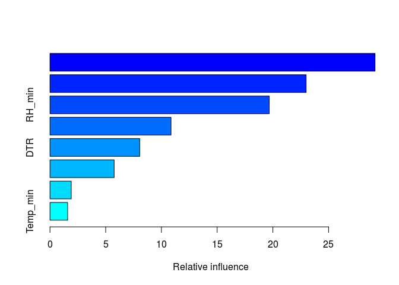<!-- -->

```
##                       var   rel.inf
## hoursAbove31 hoursAbove31 29.171626
## Temp_mean       Temp_mean 22.988853
## RH_min             RH_min 19.678318
## Temp_max         Temp_max 10.861224
## DTR                   DTR  8.051446
## RH_mean           RH_mean  5.757522
## hoursBelow16 hoursBelow16  1.908151
## Temp_min         Temp_min  1.582861
```

```r
plot(gbmModel)
```

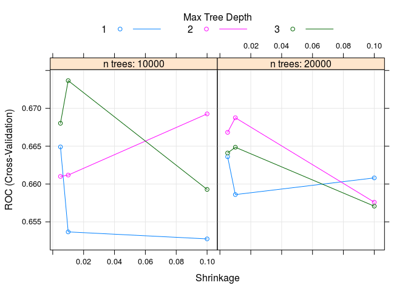<!-- -->

```r
gbmModel
```

```
## Stochastic Gradient Boosting 
## 
## 222 samples
##   8 predictors
##   2 classes: 'no', 'yes' 
## 
## No pre-processing
## Resampling: Cross-Validated (10 fold) 
## Summary of sample sizes: 200, 200, 200, 199, 201, 199, ... 
## Resampling results across tuning parameters:
## 
##   shrinkage  interaction.depth  n.trees  ROC        Sens       Spec     
##   0.005      1                  10000    0.6649070  0.6590909  0.6363636
##   0.005      1                  20000    0.6636054  0.6590909  0.6454545
##   0.005      2                  10000    0.6610021  0.6757576  0.6363636
##   0.005      2                  20000    0.6668285  0.6757576  0.6263636
##   0.005      3                  10000    0.6680269  0.6590909  0.6463636
##   0.005      3                  20000    0.6641012  0.6757576  0.6263636
##   0.010      1                  10000    0.6536742  0.6757576  0.6454545
##   0.010      1                  20000    0.6586054  0.6590909  0.6454545
##   0.010      2                  10000    0.6611811  0.6757576  0.6454545
##   0.010      2                  20000    0.6687569  0.6590909  0.6454545
##   0.010      3                  10000    0.6736605  0.6757576  0.6363636
##   0.010      3                  20000    0.6648588  0.6590909  0.6363636
##   0.100      1                  10000    0.6527514  0.6674242  0.6454545
##   0.100      1                  20000    0.6608092  0.6681818  0.6354545
##   0.100      2                  10000    0.6692665  0.6757576  0.6263636
##   0.100      2                  20000    0.6575999  0.6674242  0.6263636
##   0.100      3                  10000    0.6592872  0.6856061  0.6163636
##   0.100      3                  20000    0.6570764  0.6848485  0.6363636
## 
## Tuning parameter 'n.minobsinnode' was held constant at a value of 1
## ROC was used to select the optimal model using  the largest value.
## The final values used for the model were n.trees =
##  10000, interaction.depth = 3, shrinkage = 0.01 and n.minobsinnode = 1.
```

```r
#check performance
preds <- predict(object=gbmModel, test[,predVs], type='prob')
auc <- roc(ifelse(test[,respV]=="yes",1,0), preds[[2]])
auc$auc
```

```
## Area under the curve: 0.5723
```

The GBM performs poorly on Body with an AUC of 0.5723356.

The important variables are 

#### glmnet


```r
#create new controls and models
glmControl <- trainControl(method='cv', number=3, returnResamp='none', classProbs=T, preProcOptions = c("center", "corr", "scale")) #3 cd levels
set.seed(8675309)
glmModel <- train(train[, predVs], train[, respV], 
                  method='glmnet',  
                  metric = "Accuracy", 
                  trControl=glmControl)

plot(varImp(glmModel,scale=F))
```

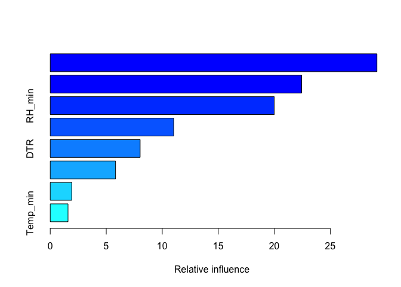<!-- -->

```r
glmModel$results
```

```
##   alpha       lambda  Accuracy     Kappa AccuracySD    KappaSD
## 1  0.10 0.0002443305 0.6486486 0.2852654 0.01351351 0.03383639
## 2  0.10 0.0024433048 0.6486486 0.2852654 0.01351351 0.03383639
## 3  0.10 0.0244330484 0.6396396 0.2703571 0.02813062 0.04967802
## 4  0.55 0.0002443305 0.6486486 0.2852654 0.01351351 0.03383639
## 5  0.55 0.0024433048 0.6486486 0.2852654 0.01351351 0.03383639
## 6  0.55 0.0244330484 0.6306306 0.2505044 0.02064223 0.03485944
## 7  1.00 0.0002443305 0.6441441 0.2757269 0.01560406 0.03784650
## 8  1.00 0.0024433048 0.6486486 0.2852654 0.01351351 0.03383639
## 9  1.00 0.0244330484 0.6306306 0.2505044 0.02064223 0.03485944
```

```r
#check performance
preds <- predict(object=glmModel, test[,predVs], type='prob')
auc <- roc(ifelse(test[,respV]=="yes",1,0), preds[[2]])
auc$auc
```

```
## Area under the curve: 0.5406
```

This performed slightly less well than the `GBM`, with an AUC of 0.5405896. The important variables are `Temp_mean`, `DTR`, `RH_mean`, `Temp_min`.

**Classification Summary**: Both models perform poorly, with an AUC of around 0.58-0.61 on the testing data. This could be due to the collinearity of the variables. Similar variables do arise as important, however, with `Temp_mean`, `DTR` and `RH_mean` coming up as especially important.


#### glmer


```r
respV <- "Body"
predVs <- c("Temp_mean","RH_mean","Temp_min","RH_min", "Temp_max", "DTR", "hoursAbove31", "hoursBelow16", "site")

#create dataframe without NAs
myCols <- c(respV, predVs)
modDF <- seasonInf %>%
  dplyr::select(one_of(myCols)) 
modDF <- na.omit(modDF)
modDF[,respV] <- as.factor(modDF[,respV])


#split into testing and training
set.seed(8675309)
inds <- createDataPartition(modDF[,respV], p=.7, list=F, times=1)
trainGLM <- modDF[inds,]
testGLM <- modDF[-inds,]

BodyEnv <- lme4::glmer(Body~ 
                         scale(Temp_mean, center=T, scale=T) 
                       + scale(DTR, center=T, scale=T) 
                       + scale(RH_mean, center=T, scale=T) 
                       + scale(Temp_min, center=T, scale=T) 
                       + scale(RH_min, center=T, scale=T) 
                       + scale(Temp_max, center=T, scale=T)
                       + scale(hoursAbove31, center=T, scale=T)
                       + scale(hoursBelow16, center=T, scale=T)
                       + (1|site) , 
                          data=trainGLM,
                          family=binomial(link="logit"))
```

```
## Warning in checkConv(attr(opt, "derivs"), opt$par, ctrl = control
## $checkConv, : Model failed to converge with max|grad| = 0.00147181 (tol =
## 0.001, component 1)
```

```r
summary(BodyEnv)
```

```
## Generalized linear mixed model fit by maximum likelihood (Laplace
##   Approximation) [glmerMod]
##  Family: binomial  ( logit )
## Formula: 
## Body ~ scale(Temp_mean, center = T, scale = T) + scale(DTR, center = T,  
##     scale = T) + scale(RH_mean, center = T, scale = T) + scale(Temp_min,  
##     center = T, scale = T) + scale(RH_min, center = T, scale = T) +  
##     scale(Temp_max, center = T, scale = T) + scale(hoursAbove31,  
##     center = T, scale = T) + scale(hoursBelow16, center = T,  
##     scale = T) + (1 | site)
##    Data: trainGLM
## 
##      AIC      BIC   logLik deviance df.resid 
##    299.2    329.9   -140.6    281.2      213 
## 
## Scaled residuals: 
##     Min      1Q  Median      3Q     Max 
## -1.6930 -0.7877 -0.4754  0.8745  1.8387 
## 
## Random effects:
##  Groups Name        Variance Std.Dev.
##  site   (Intercept) 0.08085  0.2843  
## Number of obs: 222, groups:  site, 9
## 
## Fixed effects:
##                                             Estimate Std. Error z value
## (Intercept)                                 -0.09829    0.17442  -0.564
## scale(Temp_mean, center = T, scale = T)    -25.81155   22.47198  -1.149
## scale(DTR, center = T, scale = T)            2.97015    8.32940   0.357
## scale(RH_mean, center = T, scale = T)        7.74726    8.93191   0.867
## scale(Temp_min, center = T, scale = T)      14.48982   14.99873   0.966
## scale(RH_min, center = T, scale = T)         2.37554    7.30645   0.325
## scale(hoursAbove31, center = T, scale = T)  -0.09834    0.32256  -0.305
## scale(hoursBelow16, center = T, scale = T)  -1.21328    1.22918  -0.987
##                                            Pr(>|z|)
## (Intercept)                                   0.573
## scale(Temp_mean, center = T, scale = T)       0.251
## scale(DTR, center = T, scale = T)             0.721
## scale(RH_mean, center = T, scale = T)         0.386
## scale(Temp_min, center = T, scale = T)        0.334
## scale(RH_min, center = T, scale = T)          0.745
## scale(hoursAbove31, center = T, scale = T)    0.760
## scale(hoursBelow16, center = T, scale = T)    0.324
## 
## Correlation of Fixed Effects:
##                              (Intr) scale(Temp_men,cntr=T,scl=T) s(Dc=Ts=T
## scale(Temp_men,cntr=T,scl=T) -0.027                                       
## s(DTRc=Ts=T                   0.023 -0.907                                
## scale(RH_men,cntr=T,scl=T)   -0.003  0.460                       -0.755   
## scale(Temp_min,cntr=T,scl=T)  0.031 -0.994                        0.895   
## scale(RH_min,cntr=T,scl=T)    0.000 -0.692                        0.878   
## s(A31c=Ts=T                  -0.055  0.706                       -0.599   
## s(B16c=Ts=T                  -0.008  0.558                       -0.650   
##                              scale(RH_men,cntr=T,scl=T)
## scale(Temp_men,cntr=T,scl=T)                           
## s(DTRc=Ts=T                                            
## scale(RH_men,cntr=T,scl=T)                             
## scale(Temp_min,cntr=T,scl=T) -0.458                    
## scale(RH_min,cntr=T,scl=T)   -0.911                    
## s(A31c=Ts=T                   0.083                    
## s(B16c=Ts=T                   0.344                    
##                              scale(Temp_min,cntr=T,scl=T)
## scale(Temp_men,cntr=T,scl=T)                             
## s(DTRc=Ts=T                                              
## scale(RH_men,cntr=T,scl=T)                               
## scale(Temp_min,cntr=T,scl=T)                             
## scale(RH_min,cntr=T,scl=T)    0.663                      
## s(A31c=Ts=T                  -0.706                      
## s(B16c=Ts=T                  -0.482                      
##                              scale(RH_min,cntr=T,scl=T) s(Ac=Ts=T
## scale(Temp_men,cntr=T,scl=T)                                     
## s(DTRc=Ts=T                                                      
## scale(RH_men,cntr=T,scl=T)                                       
## scale(Temp_min,cntr=T,scl=T)                                     
## scale(RH_min,cntr=T,scl=T)                                       
## s(A31c=Ts=T                  -0.249                              
## s(B16c=Ts=T                  -0.581                      0.478   
## fit warnings:
## fixed-effect model matrix is rank deficient so dropping 1 column / coefficient
## convergence code: 0
## Model failed to converge with max|grad| = 0.00147181 (tol = 0.001, component 1)
```

```r
plot(BodyEnv)
```

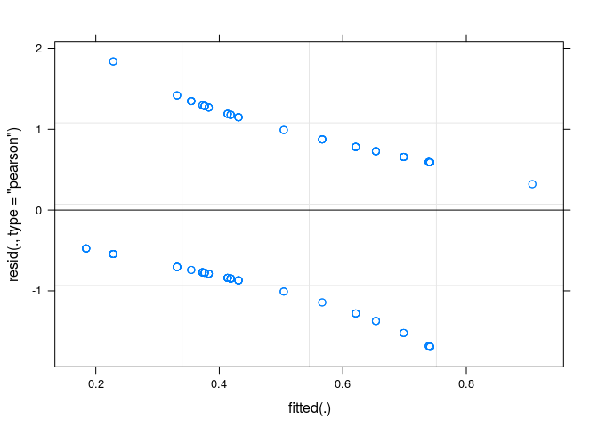<!-- -->

```r
Anova(BodyEnv)
```

```
## Analysis of Deviance Table (Type II Wald chisquare tests)
## 
## Response: Body
##                                             Chisq Df Pr(>Chisq)
## scale(Temp_mean, center = T, scale = T)    1.3193  1     0.2507
## scale(DTR, center = T, scale = T)          0.1272  1     0.7214
## scale(RH_mean, center = T, scale = T)      0.7523  1     0.3857
## scale(Temp_min, center = T, scale = T)     0.9333  1     0.3340
## scale(RH_min, center = T, scale = T)       0.1057  1     0.7451
## scale(Temp_max, center = T, scale = T)             0           
## scale(hoursAbove31, center = T, scale = T) 0.0930  1     0.7605
## scale(hoursBelow16, center = T, scale = T) 0.9743  1     0.3236
```

```r
#check performance
preds <- predict(object=BodyEnv, testGLM[,predVs], type='response')
auc <- roc(testGLM[,respV], preds)
```

The only variable that is even somewhat significant is mean Temperature (p=0.03). The other variables are also highly correlated, which makes it difficult to see which is having the largest effect. This does perform about the same as the `GBM` and `glmnet` models, with an auc of 0.5505669.

#### Model Selection using a priori variable selection

First, I will try to do model selection based on what variables the earlier lasso regression had chosen to keep.


```r
respV <- "Body"
predVs <- c("Temp_mean","RH_mean","Temp_min","RH_min", "Temp_max", "DTR", "hoursAbove31", "hoursBelow16", "site")

#create dataframe without NAs
myCols <- c(respV, predVs)
modDF <- seasonInf %>%
  dplyr::select(one_of(myCols)) 
modDF <- na.omit(modDF)
modDF[,respV] <- as.factor(modDF[,respV])


#split into testing and training
set.seed(8675309)
inds <- createDataPartition(modDF[,respV], p=.7, list=F, times=1)
trainGLM <- modDF[inds,]
testGLM <- modDF[-inds,]

BodyEnv <- lme4::glmer(Body~ 
                         scale(Temp_mean, center=T, scale=T) 
                       + scale(DTR, center=T, scale=T) 
                       + scale(RH_mean, center=T, scale=T) 
                       + scale(Temp_min, center=T, scale=T) 
                       + #scale(RH_min, center=T, scale=T) 
                       + #scale(Temp_max, center=T, scale=T)
                       + #scale(hoursAbove31, center=T, scale=T)
                       + #scale(hoursBelow16, center=T, scale=T)
                       + (1|site) , 
                          data=trainGLM,
                          family=binomial(link="logit"))

summary(BodyEnv)
```

```
## Generalized linear mixed model fit by maximum likelihood (Laplace
##   Approximation) [glmerMod]
##  Family: binomial  ( logit )
## Formula: 
## Body ~ scale(Temp_mean, center = T, scale = T) + scale(DTR, center = T,  
##     scale = T) + scale(RH_mean, center = T, scale = T) + scale(Temp_min,  
##     center = T, scale = T) + ++++(1 | site)
##    Data: trainGLM
## 
##      AIC      BIC   logLik deviance df.resid 
##    294.6    315.0   -141.3    282.6      216 
## 
## Scaled residuals: 
##     Min      1Q  Median      3Q     Max 
## -1.8650 -0.8155 -0.5555  0.9068  1.6668 
## 
## Random effects:
##  Groups Name        Variance Std.Dev.
##  site   (Intercept) 0        0       
## Number of obs: 222, groups:  site, 9
## 
## Fixed effects:
##                                         Estimate Std. Error z value
## (Intercept)                              -0.1011     0.1423  -0.710
## scale(Temp_mean, center = T, scale = T) -19.0866     9.3785  -2.035
## scale(DTR, center = T, scale = T)        -0.2624     2.0267  -0.129
## scale(RH_mean, center = T, scale = T)     8.6199     2.7211   3.168
## scale(Temp_min, center = T, scale = T)   11.3341     6.5575   1.728
##                                         Pr(>|z|)   
## (Intercept)                              0.47761   
## scale(Temp_mean, center = T, scale = T)  0.04184 * 
## scale(DTR, center = T, scale = T)        0.89696   
## scale(RH_mean, center = T, scale = T)    0.00154 **
## scale(Temp_min, center = T, scale = T)   0.08391 . 
## ---
## Signif. codes:  0 '***' 0.001 '**' 0.01 '*' 0.05 '.' 0.1 ' ' 1
## 
## Correlation of Fixed Effects:
##                              (Intr) scale(Temp_men,cntr=T,scl=T) s(Dc=Ts=T
## scale(Temp_men,cntr=T,scl=T) -0.008                                       
## s(DTRc=Ts=T                  -0.003 -0.639                                
## s(RH_c=Ts=T                   0.018 -0.616                       -0.192   
## scale(Temp_min,cntr=T,scl=T)  0.006 -0.993                        0.697   
##                              s(Rc=Ts=T
## scale(Temp_men,cntr=T,scl=T)          
## s(DTRc=Ts=T                           
## s(RH_c=Ts=T                           
## scale(Temp_min,cntr=T,scl=T)  0.533
```

```r
plot(BodyEnv)
```

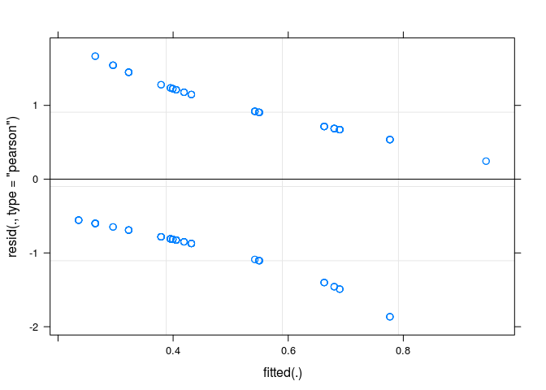<!-- -->

```r
Anova(BodyEnv)
```

```
## Analysis of Deviance Table (Type II Wald chisquare tests)
## 
## Response: Body
##                                           Chisq Df Pr(>Chisq)   
## scale(Temp_mean, center = T, scale = T)  4.1418  1   0.041836 * 
## scale(DTR, center = T, scale = T)        0.0168  1   0.896964   
## scale(RH_mean, center = T, scale = T)   10.0352  1   0.001536 **
## scale(Temp_min, center = T, scale = T)   2.9875  1   0.083911 . 
## ---
## Signif. codes:  0 '***' 0.001 '**' 0.01 '*' 0.05 '.' 0.1 ' ' 1
```

```r
#check performance
preds <- predict(object=BodyEnv, testGLM[,predVs], type='response')
auc <- roc(testGLM[,respV], preds)
```


## Try Out on Percentages

Rather than treating each individual as a sample, I am going to try for % of infected mosquitoes per site.


```r
#this isn't grouping appropriately and I don't know why...
seasonInfPC <- seasonInf %>%
  group_by(block, site) %>%
  summarise(mBody=mean(Body, na.rm=T)) %>%
  mutate(mHead=mean(Head, na.rm=T)) %>%
  mutate(mSal=mean(Saliva, na.rm=T)) %>%
  dplyr::select(-Individual, -DPI, -Body, -Head, -Saliva, - Wing) %>%
  ungroup()
  distinct(site, .keep_all=T)
```
