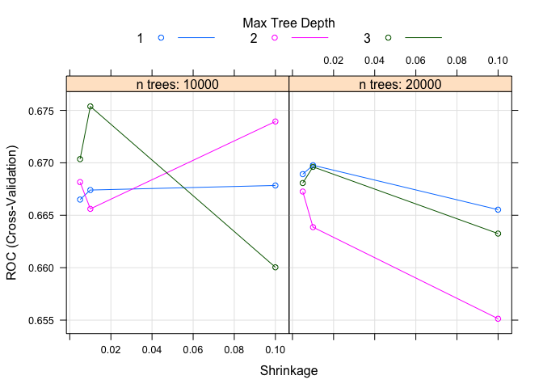
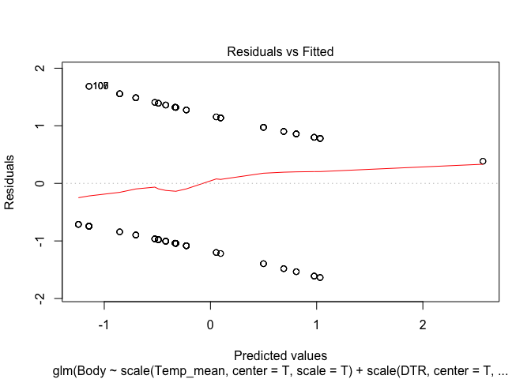
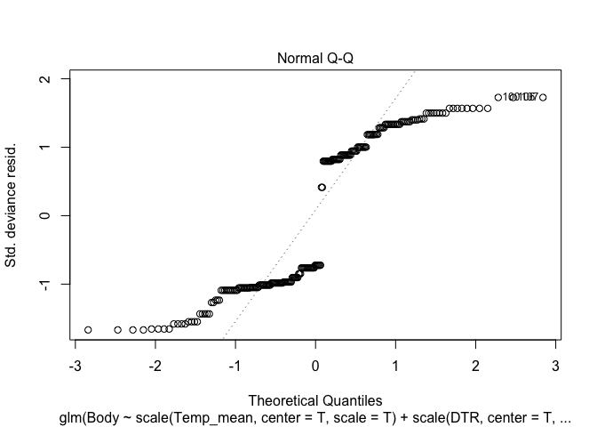
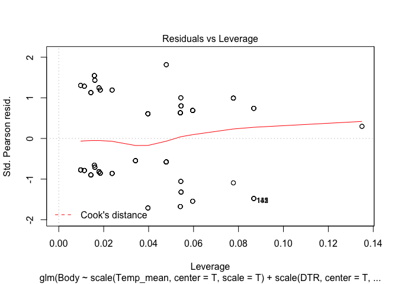
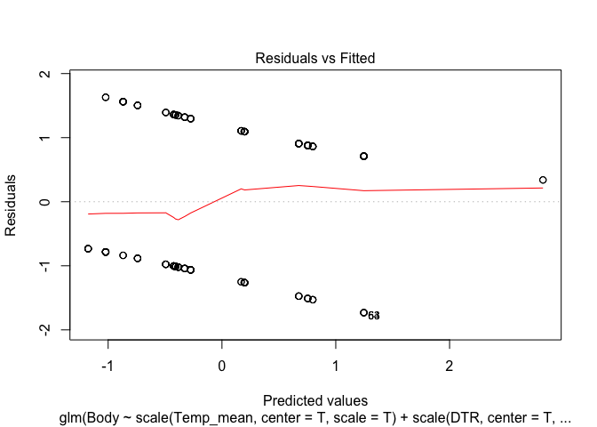
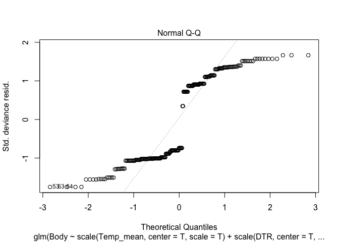
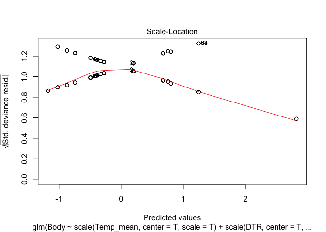
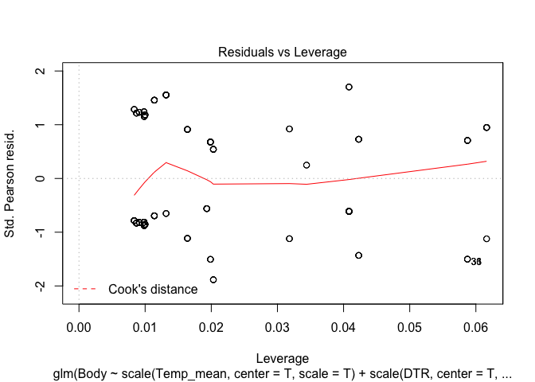

# Dengue Infections 2016
Michelle Evans  
`r format(Sys.Date())`  

This document is for the analysis of both the August and October Trials of Infections of the Dengue Microclimate project in Athens, GA in 2016.


```r
library(knitr)
knitr::opts_chunk$set(cache=TRUE)
knitr::opts_chunk$set(message=FALSE)
knitr::opts_chunk$set(warning=FALSE)
```


```r
library(xtable)
library(tidyr)
library(ggplot2) 
library(lme4) #mixed models
library(car)
library(MASS)
library(gridExtra) #for facet grids later
library(gbm)
library(caret)
library(pROC)
library(corrplot)
library(glmnet)
library(GGally)
library(dplyr)
```


```r
colR <- colRural <- "dodgerblue"
colS <- colSuburban <- "gray80"
colU <- colUrban <- "maroon"
```

# Load and Format


```r
formatData <- function(month){
  #' format infection data
  #' @params month (ie. "august")
  #' @returns dataframe of properly formatted data
  #adjust wingLength
  monthDf <- read.csv(paste0("../../data/infections/raw/", month,"Dengue.csv"))
  #convert wingLength and drop extra columns
  monthDf$Wing <- monthDf$WingLength*monthDf$conversion..mm.bar.
  monthDf <- select(monthDf, -WingLength, -conversion..mm.bar.)
  
  #dpi as factor
  monthDf$DPI <- as.factor(monthDf$DPI)
  
  #add in class and site
  monthDf$site <- as.factor(substr(as.character(monthDf$Individual), 1, 2))
  monthDf$class <- NULL
  for (i in 1:nrow(monthDf)){
    if (substr(monthDf$site[i], 1,1)=="R"){
    monthDf$class[i] <- "Rural"
    } else if (substr(monthDf$site[i], 1,1)=="S"){
    monthDf$class[i] <- "Suburban"
    } else if (substr(monthDf$site[i], 1,1)=="U"){
    monthDf$class[i] <- "Urban"
    }
  }
  monthDf$class <- as.factor(monthDf$class)
  
  #convert Y and N to 1 and 0 for statistics
  levels(monthDf$Body) <- c("NA", 0, 1)
  monthDf$Body <- as.numeric(as.character(monthDf$Body))
  levels(monthDf$Saliva) <- c("NA", 0, 1)
  monthDf$Saliva <- as.numeric(as.character(monthDf$Saliva))
  # august had no contaminated heads, so different corrections
  if (month=="august"){
    levels(monthDf$Head) <- c(0, 1)
  } else levels(monthDf$Head) <- c("NA",0, 1)
  monthDf$Head <- as.numeric(as.character(monthDf$Head))
  
  ##Fix false negatievs
  #adjust so that if saliva is positive, so is head
  #ddjust so that is head is positive, so is body
  monthDf$Head[monthDf$Saliva>0] <- 1
  monthDf$Body[monthDf$Head>0] <- 1
  
  return(monthDf)
}
```


```r
#warning messages about NAs are fine
august <- formatData("august")
oct <- formatData("october")
```

First, lets create a table of the percentages for an overview:


```r
augustSumm <- august %>%
  #drop individual
  select(-Individual) %>%
  group_by(DPI, site, class) %>%
  summarise_each(funs(mean(.,na.rm=T),sd(.,na.rm=T),se=(sd(., na.rm=T)/sqrt(n())))) %>%
  ungroup()

#print(xtable(augustSumm), type="html")
augustSumm
```

```
## # A tibble: 27 × 15
##       DPI   site    class  Body_mean Head_mean Saliva_mean Wing_mean
##    <fctr> <fctr>   <fctr>      <dbl>     <dbl>       <dbl>     <dbl>
## 1       9     R1    Rural 0.25000000      0.05         0.0  2.450526
## 2       9     R2    Rural 0.15000000      0.10         0.0  2.347500
## 3       9     R3    Rural 0.00000000      0.00         0.0  2.479500
## 4       9     S1 Suburban 0.15000000      0.10         0.0  2.495000
## 5       9     S2 Suburban 0.05263158      0.00         0.0  2.264211
## 6       9     S3 Suburban 0.30000000      0.00         0.0  2.508000
## 7       9     U1    Urban 0.25000000      0.10         0.0  2.592632
## 8       9     U2    Urban 0.10000000      0.05         0.0  2.545500
## 9       9     U3    Urban 0.00000000      0.00         0.0  2.493000
## 10     14     R1    Rural 0.10000000      0.10         0.1  2.474629
## # ... with 17 more rows, and 8 more variables: Body_sd <dbl>,
## #   Head_sd <dbl>, Saliva_sd <dbl>, Wing_sd <dbl>, Body_se <dbl>,
## #   Head_se <dbl>, Saliva_se <dbl>, Wing_se <dbl>
```

```r
octSumm <- oct %>%
  #drop individual
  select(-Individual) %>%
  group_by(DPI, site, class) %>%
  summarise_each(funs(mean(.,na.rm=T),sd(.,na.rm=T),se=(sd(., na.rm=T)/sqrt(n())))) %>%
  ungroup()

#print(xtable(octSumm), type="html")
octSumm
```

```
## # A tibble: 9 × 15
##      DPI   site    class Body_mean Head_mean Saliva_mean Wing_mean
##   <fctr> <fctr>   <fctr>     <dbl>     <dbl>       <dbl>     <dbl>
## 1     21     R1    Rural 0.6000000 0.6000000   0.0000000  2.450000
## 2     21     R2    Rural 0.6000000 0.6000000   0.1176471  2.367000
## 3     21     R3    Rural 0.7000000 0.6000000   0.0500000  2.494500
## 4     21     S1 Suburban 0.6500000 0.6000000   0.1000000  2.415000
## 5     21     S2 Suburban 0.7500000 0.7500000   0.2500000  2.415000
## 6     21     S3 Suburban 0.6315789 0.5882353   0.0000000  2.463000
## 7     21     U1    Urban 0.2000000 0.1578947   0.0000000  2.560714
## 8     21     U2    Urban 0.5789474 0.5000000   0.1000000  2.581667
## 9     21     U3    Urban 0.5500000 0.5000000   0.1000000  2.441667
## # ... with 8 more variables: Body_sd <dbl>, Head_sd <dbl>,
## #   Saliva_sd <dbl>, Wing_sd <dbl>, Body_se <dbl>, Head_se <dbl>,
## #   Saliva_se <dbl>, Wing_se <dbl>
```

# Exploratory Visualizations

## Summary Plots by Site


```r
sitePlot <- function(summTable, dpi, bodyPart){
  cols <- c(1:3,grep(bodyPart, colnames(summTable)))
temp <- summTable[summTable$DPI==dpi,cols]
colnames(temp)[4:6] <- c("mean", "sd", "se")
  barCenters <- barplot(temp$mean, 
          col=c("gray80", "dodgerblue", "maroon")[temp$class],
          names.arg=temp$site,
          ylim=c(0,max(temp$mean+0.2)),
          main = paste0(bodyPart, " Infection (", dpi, "dpi)")
          )
  #add se bars
  segments(barCenters, temp$mean - temp$se , barCenters,
         temp$mean + temp$se, lwd = 1.5)
  
  arrows(barCenters, temp$mean - temp$se , barCenters,
         temp$mean + temp$se, lwd = 1.5, 
         angle = 90,
       code = 3, length = 0.05)
}
```


## Plotting them beside each other


```r
besidePlot <- function(summTable, bodyPart, byclass=F){
  if (byclass==T){
    cols <- c(1:2,grep(bodyPart, colnames(summTable)))
  } else cols <- c(1:3,grep(bodyPart, colnames(summTable)))
  tempLarge <- summTable[,cols]
  colnames(tempLarge)[(ncol(tempLarge)-2):ncol(tempLarge)] <- c("mean", "sd", "se")
  if (byclass==F){
  tempMean <- tempLarge %>%
    select(-sd,-se, -class) %>%
    spread(DPI, mean) %>%
    select(-site)
  } else tempMean <- tempLarge %>%
    select(-sd,-se) %>%
    spread( DPI, mean) %>%
    select(-class)
  if (byclass==T){
    rownames(tempMean) <- levels(summTable$class)
    } else rownames(tempMean) <- levels(summTable$site)
  tempMean <- t(as.matrix(tempMean))
  #colors
  if (byclass==T){
    colvec <- c(rep(colRural,3), rep(colSuburban,3), 
                            rep(colUrban,3))
  } else colvec <- c(rep(colRural,9), rep(colSuburban,9), 
                            rep(colUrban,9))
  #plot
  barCenters <- barplot(tempMean, 
                      beside=T,
                      col=colvec,
                      density = c(10,40,NA),
                      names.arg=colnames(tempMean),
                      ylim=c(0,0.80),
                      main = paste0("Dengue ", bodyPart," Infections"),
                      ylab = "Percent Infected"
                      )

    if (byclass==F){
  tempSE <- tempLarge %>%
    select(-sd,-mean,-class) %>%
    spread( DPI, se) %>%
    select(-site)
  } else   tempSE <- tempLarge %>%
    select(-sd,-mean) %>%
    spread( DPI, se) %>%
    select(-class)
  
  tempSE <- t(tempSE)
  
  #add se bars
  segments(barCenters, tempMean - tempSE , barCenters,
         tempMean + tempSE, lwd = 1.5)
  
  arrows(barCenters, tempMean - tempSE , barCenters,
         tempMean + tempSE,
         lwd = 1.5, 
         angle = 90,
         code = 3, length = 0.03)
  
  legend("topright", legend=c("9 dpi","14 dpi", "21 dpi"), density = c(10,40,NA),
       bty = "n", col = "gray80")
}
```

## August Plots by DPI

Note there are none of these for October becuase we only did 21 dpi.

<!-- -->

<!-- -->

<!-- -->


## Plots by Class


```r
augustclassSumm <- august%>%
  #drop individual
  select(-Individual, -site) %>%
  group_by(DPI, class) %>%
  summarise_each(funs(mean(.,na.rm=T),sd(.,na.rm=T),se=(sd(., na.rm=T)/sqrt(n())))) %>%
  ungroup()

#print(xtable(augustclassSumm), type="html")
augustclassSumm
```

```
## # A tibble: 9 × 14
##      DPI    class Body_mean  Head_mean Saliva_mean Wing_mean   Body_sd
##   <fctr>   <fctr>     <dbl>      <dbl>       <dbl>     <dbl>     <dbl>
## 1      9    Rural 0.1333333 0.05000000  0.00000000  2.425424 0.3428033
## 2      9 Suburban 0.1694915 0.03333333  0.00000000  2.422632 0.3784060
## 3      9    Urban 0.1186441 0.05000000  0.00000000  2.542881 0.3261450
## 4     14    Rural 0.1500000 0.10000000  0.03389831  2.469423 0.3600847
## 5     14 Suburban 0.2142857 0.21428571  0.07142857  2.449395 0.4140393
## 6     14    Urban 0.3000000 0.23333333  0.05000000  2.618182 0.4621248
## 7     21    Rural 0.3928571 0.31666667  0.10000000  2.459182 0.4928054
## 8     21 Suburban 0.5614035 0.45614035  0.17543860  2.480198 0.5006262
## 9     21    Urban 0.1960784 0.18867925  0.13207547  2.617574 0.4009792
## # ... with 7 more variables: Head_sd <dbl>, Saliva_sd <dbl>,
## #   Wing_sd <dbl>, Body_se <dbl>, Head_se <dbl>, Saliva_se <dbl>,
## #   Wing_se <dbl>
```

```r
octclassSumm <- oct %>%
  select(-Individual, -site) %>%
  group_by(DPI, class) %>%
  summarise_each(funs(mean(.,na.rm=T),sd(.,na.rm=T),se=(sd(., na.rm=T)/sqrt(n())))) %>%
  ungroup()

#print(xtable(octclassSumm), type="html")
octclassSumm
```

```
## # A tibble: 3 × 14
##      DPI    class Body_mean Head_mean Saliva_mean Wing_mean   Body_sd
##   <fctr>   <fctr>     <dbl>     <dbl>       <dbl>     <dbl>     <dbl>
## 1     21    Rural 0.6400000 0.6000000  0.06382979  2.434286 0.4848732
## 2     21 Suburban 0.6511628 0.6097561  0.06976744  2.436818 0.4822428
## 3     21    Urban 0.4406780 0.3859649  0.06779661  2.525400 0.5007300
## # ... with 7 more variables: Head_sd <dbl>, Saliva_sd <dbl>,
## #   Wing_sd <dbl>, Body_se <dbl>, Head_se <dbl>, Saliva_se <dbl>,
## #   Wing_se <dbl>
```


## Comparing Seasons in Plots

Because I only have data for 21 dpi in October, that is all I will compare. This will make a plot that compares mean infections by class and body part across seasons. I can then "facet" these together to have three showing similar things for each body part.


<!-- -->


# Statistical Analysis

Response Variable: Body, Head, and Saliva Infection Rates

Predictor Variables:

**Test 1**: Season & Land-Use

Based on the results of this, I want to know if this is in fact driven by microclimate:

**Test 2**: Microclimate (Temp and RH Variables)

Out of curiousity, also 

**Test 3**: Wing Length

And for a supplement, if we wanted to look at EIP rates:

**Test 4**: DPI

## Test 1: Season and Land-Use

I want to explore if season and land-use significantly influence infection dynamics. This will actually involve three tests (one each for body, head, saliva). I can then either a) test all DPI's at once with DPI as block factor (which may lead to strange results becuase of no 9 and 14 for october), or b) do each DPI seperately. I am currently going with the latter, which means I can only compare season for 21 dpi.

Using a Mixed-Effects Model with site as a random factor:

This [thread](https://stats.stackexchange.com/questions/134630/assessing-fit-of-binomial-glmer-in-r-with-only-categorical-predictors) has good info on how to assess accuracy of `glmer`.

So many examples (including some based on Bolker et al. 2009): http://glmm.wikidot.com/examples


I could make a function to do all this, but it is better to look at each individually.

### August 9 DPI


```
## Generalized linear mixed model fit by maximum likelihood (Laplace
##   Approximation) [glmerMod]
##  Family: binomial  ( logit )
## Formula: Body ~ class + (1 | site)
##    Data: august[august$DPI == "9", ]
## 
##      AIC      BIC   logLik deviance df.resid 
##    149.9    162.7    -71.0    141.9      174 
## 
## Scaled residuals: 
##     Min      1Q  Median      3Q     Max 
## -0.5552 -0.4225 -0.3444 -0.2728  2.9832 
## 
## Random effects:
##  Groups Name        Variance Std.Dev.
##  site   (Intercept) 0.4149   0.6441  
## Number of obs: 178, groups:  site, 9
## 
## Fixed effects:
##               Estimate Std. Error z value Pr(>|z|)    
## (Intercept)    -2.0228     0.5625  -3.596 0.000323 ***
## classSuburban   0.3117     0.7531   0.414 0.678967    
## classUrban     -0.1547     0.7831  -0.198 0.843419    
## ---
## Signif. codes:  0 '***' 0.001 '**' 0.01 '*' 0.05 '.' 0.1 ' ' 1
## 
## Correlation of Fixed Effects:
##             (Intr) clssSb
## classSubrbn -0.714       
## classUrban  -0.665  0.500
```

```
## Analysis of Deviance Table (Type II Wald chisquare tests)
## 
## Response: Body
##        Chisq Df Pr(>Chisq)
## class 0.3897  2      0.823
```

```
##       chisq       ratio         rdf           p 
## 151.2583871   0.8693011 174.0000000   0.8926038
```

<!-- -->


```
## Generalized linear mixed model fit by maximum likelihood (Laplace
##   Approximation) [glmerMod]
##  Family: binomial  ( logit )
## Formula: Head ~ class + (1 | site)
##    Data: august[august$DPI == "9", ]
## 
##      AIC      BIC   logLik deviance df.resid 
##     73.2     86.0    -32.6     65.2      176 
## 
## Scaled residuals: 
##     Min      1Q  Median      3Q     Max 
## -0.2294 -0.2294 -0.2294 -0.1857  5.3852 
## 
## Random effects:
##  Groups Name        Variance Std.Dev.
##  site   (Intercept) 4e-14    2e-07   
## Number of obs: 180, groups:  site, 9
## 
## Fixed effects:
##                 Estimate Std. Error z value Pr(>|z|)    
## (Intercept)   -2.944e+00  5.923e-01  -4.971 6.67e-07 ***
## classSuburban -4.229e-01  9.317e-01  -0.454     0.65    
## classUrban     1.628e-14  8.377e-01   0.000     1.00    
## ---
## Signif. codes:  0 '***' 0.001 '**' 0.01 '*' 0.05 '.' 0.1 ' ' 1
## 
## Correlation of Fixed Effects:
##             (Intr) clssSb
## classSubrbn -0.636       
## classUrban  -0.707  0.450
```

```
## Analysis of Deviance Table (Type II Wald chisquare tests)
## 
## Response: Head
##        Chisq Df Pr(>Chisq)
## class 0.2581  2     0.8789
```

```
##      chisq      ratio        rdf          p 
## 180.000000   1.022727 176.000000   0.402422
```

There was no saliva infections at 9 dpi, so not even running a test on that.

The above code runs a mixed model on body and head infection in August at 9 dpi with site as a random factor. There is **no significant effect of class on body or head infection in August trial 9 dpi**.

### August 14 DPI


```
## Generalized linear mixed model fit by maximum likelihood (Laplace
##   Approximation) [glmerMod]
##  Family: binomial  ( logit )
## Formula: Body ~ class + (1 | site)
##    Data: august[august$DPI == "14", ]
## 
##      AIC      BIC   logLik deviance df.resid 
##    190.2    202.9    -91.1    182.2      172 
## 
## Scaled residuals: 
##     Min      1Q  Median      3Q     Max 
## -0.6602 -0.5230 -0.4209 -0.4184  2.3903 
## 
## Random effects:
##  Groups Name        Variance Std.Dev.
##  site   (Intercept) 0.006192 0.07869 
## Number of obs: 176, groups:  site, 9
## 
## Fixed effects:
##               Estimate Std. Error z value Pr(>|z|)    
## (Intercept)    -1.7367     0.3671  -4.731 2.24e-06 ***
## classSuburban   0.4360     0.4912   0.887   0.3748    
## classUrban      0.8882     0.4634   1.917   0.0553 .  
## ---
## Signif. codes:  0 '***' 0.001 '**' 0.01 '*' 0.05 '.' 0.1 ' ' 1
## 
## Correlation of Fixed Effects:
##             (Intr) clssSb
## classSubrbn -0.740       
## classUrban  -0.785  0.585
```

```
## Analysis of Deviance Table (Type II Wald chisquare tests)
## 
## Response: Body
##       Chisq Df Pr(>Chisq)
## class 3.757  2     0.1528
```

```
##       chisq       ratio         rdf           p 
## 175.6184916   1.0210377 172.0000000   0.4091873
```

This is approaching signficance, with Urban mosquitoes more likely to be infected (coef=0.888, p=0.1528).


```
## Generalized linear mixed model fit by maximum likelihood (Laplace
##   Approximation) [glmerMod]
##  Family: binomial  ( logit )
## Formula: Head ~ class + (1 | site)
##    Data: august[august$DPI == "14", ]
## 
##      AIC      BIC   logLik deviance df.resid 
##    170.4    183.1    -81.2    162.4      172 
## 
## Scaled residuals: 
##     Min      1Q  Median      3Q     Max 
## -0.5517 -0.5517 -0.5222 -0.3333  3.0000 
## 
## Random effects:
##  Groups Name        Variance Std.Dev.
##  site   (Intercept) 0        0       
## Number of obs: 176, groups:  site, 9
## 
## Fixed effects:
##               Estimate Std. Error z value Pr(>|z|)    
## (Intercept)    -2.1972     0.4303  -5.106 3.29e-07 ***
## classSuburban   0.8979     0.5397   1.664   0.0961 .  
## classUrban      1.0076     0.5276   1.910   0.0561 .  
## ---
## Signif. codes:  0 '***' 0.001 '**' 0.01 '*' 0.05 '.' 0.1 ' ' 1
## 
## Correlation of Fixed Effects:
##             (Intr) clssSb
## classSubrbn -0.797       
## classUrban  -0.816  0.650
```

```
## Analysis of Deviance Table (Type II Wald chisquare tests)
## 
## Response: Head
##        Chisq Df Pr(>Chisq)
## class 3.9559  2     0.1384
```

```
##       chisq       ratio         rdf           p 
## 176.0000000   1.0232558 172.0000000   0.4013319
```

As above, head infection is close to significance, with urban more likely than rural, but suburban and urban very similar.


```
## Generalized linear mixed model fit by maximum likelihood (Laplace
##   Approximation) [glmerMod]
##  Family: binomial  ( logit )
## Formula: Saliva ~ class + (1 | site)
##    Data: august[august$DPI == "14", ]
## 
##      AIC      BIC   logLik deviance df.resid 
##     77.9     90.5    -34.9     69.9      171 
## 
## Scaled residuals: 
##     Min      1Q  Median      3Q     Max 
## -0.3258 -0.2451 -0.2192 -0.1631  4.8304 
## 
## Random effects:
##  Groups Name        Variance Std.Dev.
##  site   (Intercept) 0.2858   0.5346  
## Number of obs: 175, groups:  site, 9
## 
## Fixed effects:
##               Estimate Std. Error z value Pr(>|z|)    
## (Intercept)    -3.4865     0.8602  -4.053 5.06e-05 ***
## classSuburban   0.8247     1.0064   0.819    0.413    
## classUrban      0.4269     1.0454   0.408    0.683    
## ---
## Signif. codes:  0 '***' 0.001 '**' 0.01 '*' 0.05 '.' 0.1 ' ' 1
## 
## Correlation of Fixed Effects:
##             (Intr) clssSb
## classSubrbn -0.761       
## classUrban  -0.728  0.604
```

```
## Analysis of Deviance Table (Type II Wald chisquare tests)
## 
## Response: Saliva
##        Chisq Df Pr(>Chisq)
## class 0.6833  2     0.7106
```

```
##       chisq       ratio         rdf           p 
## 152.5602239   0.8921651 171.0000000   0.8411013
```

No difference in Saliva.

**At 9 and 14 dpi, there is no significant effect of class on the infection dynamics. Based on this, I am choosing to only focus on the 21 dpi for future statistical tests.**

### Season x Class 21 DPI


```r
#explore data
ggplot(data=seasons[seasons$DPI=="21",], aes(factor(class))) +
  geom_bar(stat="identity",aes(y=Body)) +
  facet_wrap(~block) + 
  ggtitle("21 dpi Body across Seasons")
```

<!-- -->

```r
#model
mixModelseasonsBody21 <- lme4::glmer(Body~class + block + block*class + (1|site), 
                          data=seasons[seasons$DPI=="21",],
                          family=binomial(link="logit"))
#get a summary
summary(mixModelseasonsBody21)
```

```
## Generalized linear mixed model fit by maximum likelihood (Laplace
##   Approximation) [glmerMod]
##  Family: binomial  ( logit )
## Formula: Body ~ class + block + block * class + (1 | site)
##    Data: seasons[seasons$DPI == "21", ]
## 
##      AIC      BIC   logLik deviance df.resid 
##    419.6    445.9   -202.8    405.6      309 
## 
## Scaled residuals: 
##     Min      1Q  Median      3Q     Max 
## -1.3663 -0.8876 -0.4939  0.8839  2.0248 
## 
## Random effects:
##  Groups Name        Variance Std.Dev.
##  site   (Intercept) 0        0       
## Number of obs: 316, groups:  site, 9
## 
## Fixed effects:
##                           Estimate Std. Error z value Pr(>|z|)  
## (Intercept)                0.57536    0.29463   1.953   0.0508 .
## classSuburban              0.04879    0.43496   0.112   0.9107  
## classUrban                -0.81378    0.39442  -2.063   0.0391 *
## blocksummer               -1.01068    0.40208  -2.514   0.0120 *
## classSuburban:blocksummer  0.63339    0.57906   1.094   0.2740  
## classUrban:blocksummer    -0.16189    0.59567  -0.272   0.7858  
## ---
## Signif. codes:  0 '***' 0.001 '**' 0.01 '*' 0.05 '.' 0.1 ' ' 1
## 
## Correlation of Fixed Effects:
##             (Intr) clssSb clssUr blcksm clssS:
## classSubrbn -0.677                            
## classUrban  -0.747  0.506                     
## blocksummer -0.733  0.496  0.547              
## clssSbrbn:b  0.509 -0.751 -0.380 -0.694       
## clssUrbn:bl  0.495 -0.335 -0.662 -0.675  0.469
```

```r
#check significance
Anova(mixModelseasonsBody21) 
```

```
## Analysis of Deviance Table (Type II Wald chisquare tests)
## 
## Response: Body
##               Chisq Df Pr(>Chisq)    
## class       18.1680  2  0.0001135 ***
## block       12.2712  1  0.0004600 ***
## class:block  1.9851  2  0.3706257    
## ---
## Signif. codes:  0 '***' 0.001 '**' 0.01 '*' 0.05 '.' 0.1 ' ' 1
```

```r
#check overdispersion
overdisp_fun(mixModelseasonsBody21) 
```

```
##       chisq       ratio         rdf           p 
## 315.9999988   1.0226537 309.0000000   0.3797057
```

```r
plot(mixModelseasonsBody21)
```

<!-- -->

```r
#Predict onto real data and compare
# test21 <- predict(mixModelseasonsBody21, data=seasons[seasons$DPI=="21",])
# plot(y=seasons[as.numeric(names(test21)), 'Body'], x=test21, 
#      col=c(colR,colS, colU)[as.numeric(seasons[as.numeric(names(test21)), 'class'])],
#      pch=c(15,17)[as.numeric(seasons[as.numeric(names(test21)), 'block'])],
#      xlab="Model Predictions",
#      ylab="Observed Values")
```

We find that class and block have a significant effect on Body infection at 21 days, but there is no interaction between the two.


```r
#explore data
ggplot(data=seasons[seasons$DPI=="21",], aes(factor(class))) +
  geom_bar(stat="identity",aes(y=Head)) +
  facet_wrap(~block) +
  ggtitle("21 dpi Head Across Seasons")
```

<!-- -->

```r
#model
mixModelseasonsHead21 <- lme4::glmer(Head~class + block + block*class + (1|site), 
                          data=seasons[seasons$DPI=="21",],
                          family=binomial(link="logit"))
#get a summary
summary(mixModelseasonsHead21)
```

```
## Generalized linear mixed model fit by maximum likelihood (Laplace
##   Approximation) [glmerMod]
##  Family: binomial  ( logit )
## Formula: Head ~ class + block + block * class + (1 | site)
##    Data: seasons[seasons$DPI == "21", ]
## 
##      AIC      BIC   logLik deviance df.resid 
##    417.0    443.3   -201.5    403.0      311 
## 
## Scaled residuals: 
##     Min      1Q  Median      3Q     Max 
## -1.2500 -0.7928 -0.4822  0.8165  2.0736 
## 
## Random effects:
##  Groups Name        Variance  Std.Dev. 
##  site   (Intercept) 6.679e-14 2.584e-07
## Number of obs: 318, groups:  site, 9
## 
## Fixed effects:
##                           Estimate Std. Error z value Pr(>|z|)   
## (Intercept)                0.40547    0.28867   1.405  0.16015   
## classSuburban              0.04082    0.43108   0.095  0.92456   
## classUrban                -0.86977    0.39669  -2.193  0.02834 * 
## blocksummer               -1.17460    0.40044  -2.933  0.00335 **
## classSuburban:blocksummer  0.55242    0.57756   0.956  0.33883   
## classUrban:blocksummer     0.18029    0.59803   0.302  0.76305   
## ---
## Signif. codes:  0 '***' 0.001 '**' 0.01 '*' 0.05 '.' 0.1 ' ' 1
## 
## Correlation of Fixed Effects:
##             (Intr) clssSb clssUr blcksm clssS:
## classSubrbn -0.670                            
## classUrban  -0.728  0.487                     
## blocksummer -0.721  0.483  0.525              
## clssSbrbn:b  0.500 -0.746 -0.364 -0.693       
## clssUrbn:bl  0.483 -0.323 -0.663 -0.670  0.464
```

```r
#check significance
Anova(mixModelseasonsHead21) 
```

```
## Analysis of Deviance Table (Type II Wald chisquare tests)
## 
## Response: Head
##               Chisq Df Pr(>Chisq)    
## class       14.2528  2  0.0008036 ***
## block       14.9093  1  0.0001128 ***
## class:block  0.9408  2  0.6247647    
## ---
## Signif. codes:  0 '***' 0.001 '**' 0.01 '*' 0.05 '.' 0.1 ' ' 1
```

```r
#check overdispersion
overdisp_fun(mixModelseasonsHead21) 
```

```
##      chisq      ratio        rdf          p 
## 318.000000   1.022508 311.000000   0.380076
```

Again, there is a significant effect of class and block, but no interaction. Similar effects as with the body infections.

<!-- -->

```
## Generalized linear mixed model fit by maximum likelihood (Laplace
##   Approximation) [glmerMod]
##  Family: binomial  ( logit )
## Formula: Saliva ~ class + block + block * class + (1 | site)
##    Data: seasons[seasons$DPI == "21", ]
## 
##      AIC      BIC   logLik deviance df.resid 
##    220.7    247.0   -103.3    206.7      312 
## 
## Scaled residuals: 
##     Min      1Q  Median      3Q     Max 
## -0.4618 -0.3899 -0.2741 -0.2695  3.8307 
## 
## Random effects:
##  Groups Name        Variance  Std.Dev.
##  site   (Intercept) 0.0006547 0.02559 
## Number of obs: 319, groups:  site, 9
## 
## Fixed effects:
##                           Estimate Std. Error z value Pr(>|z|)    
## (Intercept)               -2.68591    0.60093  -4.470 7.84e-06 ***
## classSuburban              0.09513    0.84640   0.112    0.911    
## classUrban                 0.06458    0.79045   0.082    0.935    
## blocksummer                0.48842    0.73590   0.664    0.507    
## classSuburban:blocksummer  0.55471    1.01313   0.548    0.584    
## classUrban:blocksummer     0.24985    0.98727   0.253    0.800    
## ---
## Signif. codes:  0 '***' 0.001 '**' 0.01 '*' 0.05 '.' 0.1 ' ' 1
## 
## Correlation of Fixed Effects:
##             (Intr) clssSb clssUr blcksm clssS:
## classSubrbn -0.695                            
## classUrban  -0.751  0.532                     
## blocksummer -0.808  0.571  0.612              
## clssSbrbn:b  0.577 -0.837 -0.444 -0.725       
## clssUrbn:bl  0.603 -0.425 -0.800 -0.746  0.539
```

```
## Analysis of Deviance Table (Type II Wald chisquare tests)
## 
## Response: Saliva
##              Chisq Df Pr(>Chisq)  
## class       1.1055  2    0.57538  
## block       3.6297  1    0.05676 .
## class:block 0.3023  2    0.85971  
## ---
## Signif. codes:  0 '***' 0.001 '**' 0.01 '*' 0.05 '.' 0.1 ' ' 1
```

```
##      chisq      ratio        rdf          p 
## 318.919342   1.022177 312.000000   0.381472
```

There is **no significant effect on saliva**. There is almost (p=0.056) an effect of block, but not quite.

## Test 2: Microclimate

Based on the results of Test 1, we only see a difference in infection at 21 dpi sampling time point, so this is all we will use in our microclimate tests.

### Load and Format Microclimate Data


```
## [1] "2016-08-01 17:04:48 EDT" "2016-08-05 09:14:48 EDT"
```

```
## [1] "2016-08-01 17:07:27 EDT" "2016-11-07 16:51:04 EST"
```

We need to correct these for the days when mosquitoes were actually collected, and the number of mosquitoes from each tray.


This results in a dataframe `seasonInf` that has the infection status and environmental variables associated with each individual in both seasons.

### Stats

#### Visualization


<!-- -->

```
## TableGrob (3 x 3) "arrange": 9 grobs
##   z     cells    name           grob
## 1 1 (1-1,1-1) arrange gtable[layout]
## 2 2 (1-1,2-2) arrange gtable[layout]
## 3 3 (1-1,3-3) arrange gtable[layout]
## 4 4 (2-2,1-1) arrange gtable[layout]
## 5 5 (2-2,2-2) arrange gtable[layout]
## 6 6 (2-2,3-3) arrange gtable[layout]
## 7 7 (3-3,1-1) arrange gtable[layout]
## 8 8 (3-3,2-2) arrange gtable[layout]
## 9 9 (3-3,3-3) arrange gtable[layout]
```

<!-- -->

```
## TableGrob (3 x 3) "arrange": 9 grobs
##   z     cells    name           grob
## 1 1 (1-1,1-1) arrange gtable[layout]
## 2 2 (1-1,2-2) arrange gtable[layout]
## 3 3 (1-1,3-3) arrange gtable[layout]
## 4 4 (2-2,1-1) arrange gtable[layout]
## 5 5 (2-2,2-2) arrange gtable[layout]
## 6 6 (2-2,3-3) arrange gtable[layout]
## 7 7 (3-3,1-1) arrange gtable[layout]
## 8 8 (3-3,2-2) arrange gtable[layout]
## 9 9 (3-3,3-3) arrange gtable[layout]
```

<!-- -->

```
## TableGrob (3 x 3) "arrange": 9 grobs
##   z     cells    name           grob
## 1 1 (1-1,1-1) arrange gtable[layout]
## 2 2 (1-1,2-2) arrange gtable[layout]
## 3 3 (1-1,3-3) arrange gtable[layout]
## 4 4 (2-2,1-1) arrange gtable[layout]
## 5 5 (2-2,2-2) arrange gtable[layout]
## 6 6 (2-2,3-3) arrange gtable[layout]
## 7 7 (3-3,1-1) arrange gtable[layout]
## 8 8 (3-3,2-2) arrange gtable[layout]
## 9 9 (3-3,3-3) arrange gtable[layout]
```

There doesn't seem to be much of an effect of any of them on saliva infection, but all the temperature variables seem to have a similar effect, and the RH variables an inverse (which makes sense). RH max is super weird because most of them have 100, so I will not use it in the glmer model.

We can also check out some collinearity and correlations.

<!-- -->

There are some variables that are highly correlated. 

#### GBM

Because the response is binary, I'm going to give it a shot using glmnet and GBM. Also, there is no longer a random effect of site because the environmental variables are aggregated by site.


```
## 
##         0         1 
## 0.5253165 0.4746835
```


```r
summary(gbmModel)
```

<!-- -->

```
##                       var   rel.inf
## hoursAbove31 hoursAbove31 29.168174
## Temp_mean       Temp_mean 22.443764
## RH_min             RH_min 19.999434
## Temp_max         Temp_max 11.022955
## DTR                   DTR  8.026170
## RH_mean           RH_mean  5.830620
## hoursBelow16 hoursBelow16  1.921181
## Temp_min         Temp_min  1.587702
```

```r
plot(gbmModel)
```

<!-- -->

```r
gbmModel
```

```
## Stochastic Gradient Boosting 
## 
## 222 samples
##   8 predictor
##   2 classes: 'no', 'yes' 
## 
## No pre-processing
## Resampling: Cross-Validated (10 fold) 
## Summary of sample sizes: 200, 200, 200, 200, 199, 200, ... 
## Resampling results across tuning parameters:
## 
##   shrinkage  interaction.depth  n.trees  ROC        Sens       Spec     
##   0.005      1                  10000    0.6664945  0.6477273  0.6263636
##   0.005      1                  20000    0.6689187  0.6560606  0.6163636
##   0.005      2                  10000    0.6681612  0.6560606  0.5990909
##   0.005      2                  20000    0.6672590  0.6560606  0.6263636
##   0.005      3                  10000    0.6703512  0.6560606  0.6263636
##   0.005      3                  20000    0.6680716  0.6651515  0.6172727
##   0.010      1                  10000    0.6674036  0.6477273  0.6263636
##   0.010      1                  20000    0.6697658  0.6560606  0.5990909
##   0.010      2                  10000    0.6656061  0.6560606  0.6081818
##   0.010      2                  20000    0.6638636  0.6568182  0.6172727
##   0.010      3                  10000    0.6753788  0.6651515  0.6172727
##   0.010      3                  20000    0.6696143  0.6734848  0.5981818
##   0.100      1                  10000    0.6678375  0.6734848  0.6163636
##   0.100      1                  20000    0.6655303  0.6477273  0.6163636
##   0.100      2                  10000    0.6739394  0.6568182  0.6081818
##   0.100      2                  20000    0.6551309  0.6810606  0.5890909
##   0.100      3                  10000    0.6600344  0.6651515  0.5881818
##   0.100      3                  20000    0.6632507  0.6727273  0.5872727
## 
## Tuning parameter 'n.minobsinnode' was held constant at a value of 1
## ROC was used to select the optimal model using  the largest value.
## The final values used for the model were n.trees =
##  10000, interaction.depth = 3, shrinkage = 0.01 and n.minobsinnode = 1.
```

```r
#check performance
preds <- predict(object=gbmModel, test[,predVs], type='prob')
aucGBM <- roc(ifelse(test[,respV]=="yes",1,0), preds[[2]])
```

The GBM performs not so great on Body with an AUC of .

The important variables are 

#### glmnet


```r
#create new controls and models
glmControl <- trainControl(method='cv', number=3, returnResamp='none', classProbs=T, preProcOptions = c("center", "corr", "scale")) #3 cd levels
set.seed(8675309)
glmModel <- train(train[, predVs], train[, respV], 
                  method='glmnet',  
                  metric = "Accuracy", 
                  trControl=glmControl)

plot(varImp(glmModel,scale=F))
```

<!-- -->

```r
glmModel$results
```

```
##   alpha       lambda  Accuracy     Kappa AccuracySD    KappaSD
## 1  0.10 0.0002443305 0.6486486 0.2852654 0.01351351 0.03383639
## 2  0.10 0.0024433048 0.6486486 0.2852654 0.01351351 0.03383639
## 3  0.10 0.0244330484 0.6396396 0.2703571 0.02813062 0.04967802
## 4  0.55 0.0002443305 0.6486486 0.2852654 0.01351351 0.03383639
## 5  0.55 0.0024433048 0.6486486 0.2852654 0.01351351 0.03383639
## 6  0.55 0.0244330484 0.6306306 0.2505044 0.02064223 0.03485944
## 7  1.00 0.0002443305 0.6441441 0.2757269 0.01560406 0.03784650
## 8  1.00 0.0024433048 0.6486486 0.2852654 0.01351351 0.03383639
## 9  1.00 0.0244330484 0.6306306 0.2505044 0.02064223 0.03485944
```

```r
#check performance
preds <- predict(object=glmModel, test[,predVs], type='prob')
aucGLMnet <- roc(ifelse(test[,respV]=="yes",1,0), preds[[2]])
```

This performed slightly better than the `GBM`, with an AUC of 0.5405896. The important variables are `Temp_mean`, `DTR`, `RH_mean`, `Temp_min`.

**Classification Summary**: Both models perform poorly, with an AUC of around 0.58-0.61 on the testing data. This could be due to the collinearity of the variables. Similar variables do arise as important, however, with `Temp_mean`, `DTR` and `RH_mean` coming up as especially important.


#### glm

We can try this out with a generalized linear model (note we don't need a mixed-model because we have no random effect of site).


```r
#drop Tmax because it is rank deficient
BodyEnv <- glm(Body~ 
                         scale(Temp_mean, center=T, scale=T) 
                       + scale(DTR, center=T, scale=T) 
                       + scale(RH_mean, center=T, scale=T) 
                       + scale(Temp_min, center=T, scale=T) 
                       + scale(RH_min, center=T, scale=T) 
                       #+ scale(Temp_max, center=T, scale=T)
                       + scale(hoursAbove31, center=T, scale=T)
                       + scale(hoursBelow16, center=T, scale=T), 
                          data=train,
                          family=binomial(link="logit"))

summary(BodyEnv)
```

```
## 
## Call:
## glm(formula = Body ~ scale(Temp_mean, center = T, scale = T) + 
##     scale(DTR, center = T, scale = T) + scale(RH_mean, center = T, 
##     scale = T) + scale(Temp_min, center = T, scale = T) + scale(RH_min, 
##     center = T, scale = T) + scale(hoursAbove31, center = T, 
##     scale = T) + scale(hoursBelow16, center = T, scale = T), 
##     family = binomial(link = "logit"), data = train)
## 
## Deviance Residuals: 
##     Min       1Q   Median       3Q      Max  
## -1.6353  -1.0046  -0.7118   1.1370   1.6854  
## 
## Coefficients:
##                                             Estimate Std. Error z value
## (Intercept)                                 -0.10626    0.14366  -0.740
## scale(Temp_mean, center = T, scale = T)    -22.31916   18.11438  -1.232
## scale(DTR, center = T, scale = T)            0.96656    6.10257   0.158
## scale(RH_mean, center = T, scale = T)        9.97013    7.03238   1.418
## scale(Temp_min, center = T, scale = T)      12.33590   12.25068   1.007
## scale(RH_min, center = T, scale = T)         0.45385    5.23052   0.087
## scale(hoursAbove31, center = T, scale = T)  -0.05879    0.27508  -0.214
## scale(hoursBelow16, center = T, scale = T)  -0.88540    0.86941  -1.018
##                                            Pr(>|z|)
## (Intercept)                                   0.460
## scale(Temp_mean, center = T, scale = T)       0.218
## scale(DTR, center = T, scale = T)             0.874
## scale(RH_mean, center = T, scale = T)         0.156
## scale(Temp_min, center = T, scale = T)        0.314
## scale(RH_min, center = T, scale = T)          0.931
## scale(hoursAbove31, center = T, scale = T)    0.831
## scale(hoursBelow16, center = T, scale = T)    0.308
## 
## (Dispersion parameter for binomial family taken to be 1)
## 
##     Null deviance: 307.11  on 221  degrees of freedom
## Residual deviance: 281.42  on 214  degrees of freedom
## AIC: 297.42
## 
## Number of Fisher Scoring iterations: 4
```

```r
plot(BodyEnv)
```

<!-- --><!-- --><!-- --><!-- -->

```r
#check performance
preds <- predict(object=BodyEnv, test[,predVs], type='response')
aucGLM <- roc(test[,respV], preds)
```

The only variable that is even somewhat significant is mean RH(p=0.04 and mean Temp (0.05). The other variables are also highly correlated, which makes it difficult to see which is having the largest effect. This does perform about the same as the `GBM` and `glmnet` models, with an auc of 0.5356009. It's AIC is 297.4205384

#### Model Selection using a priori variable selection

First, I will try to do model selection based on what variables the earlier lasso regression had chosen to keep.


```r
BodyEnvMS <- glm(Body~ 
                         scale(Temp_mean, center=T, scale=T) 
                       + scale(DTR, center=T, scale=T) 
                       + scale(RH_mean, center=T, scale=T) 
                       + scale(Temp_min, center=T, scale=T), 
                       #+ scale(RH_min, center=T, scale=T) 
                       #+ scale(Temp_max, center=T, scale=T)
                       #+ scale(hoursAbove31, center=T, scale=T)
                       #+ scale(hoursBelow16, center=T, scale=T), 
                          data=train,
                          family=binomial(link="logit"))

summary(BodyEnvMS)
```

```
## 
## Call:
## glm(formula = Body ~ scale(Temp_mean, center = T, scale = T) + 
##     scale(DTR, center = T, scale = T) + scale(RH_mean, center = T, 
##     scale = T) + scale(Temp_min, center = T, scale = T), family = binomial(link = "logit"), 
##     data = train)
## 
## Deviance Residuals: 
##     Min       1Q   Median       3Q      Max  
## -1.7316  -1.0098  -0.7334   1.0956   1.6305  
## 
## Coefficients:
##                                         Estimate Std. Error z value
## (Intercept)                              -0.1011     0.1423  -0.710
## scale(Temp_mean, center = T, scale = T) -19.0866     9.3937  -2.032
## scale(DTR, center = T, scale = T)        -0.2624     2.0282  -0.129
## scale(RH_mean, center = T, scale = T)     8.6199     2.7226   3.166
## scale(Temp_min, center = T, scale = T)   11.3341     6.5681   1.726
##                                         Pr(>|z|)   
## (Intercept)                              0.47761   
## scale(Temp_mean, center = T, scale = T)  0.04217 * 
## scale(DTR, center = T, scale = T)        0.89704   
## scale(RH_mean, center = T, scale = T)    0.00155 **
## scale(Temp_min, center = T, scale = T)   0.08441 . 
## ---
## Signif. codes:  0 '***' 0.001 '**' 0.01 '*' 0.05 '.' 0.1 ' ' 1
## 
## (Dispersion parameter for binomial family taken to be 1)
## 
##     Null deviance: 307.11  on 221  degrees of freedom
## Residual deviance: 282.59  on 217  degrees of freedom
## AIC: 292.59
## 
## Number of Fisher Scoring iterations: 4
```

```r
plot(BodyEnvMS)
```

<!-- --><!-- --><!-- --><!-- -->

```r
#check performance
preds <- predict(object=BodyEnvMS, test[,predVs], type='response')
aucGLMMS <- roc(test[,respV], preds)
AIC(BodyEnvMS)
```

```
## [1] 292.5908
```


The BIC value of this is 309.6042119 compare to 324.6419575 for the one without variable selection.  It's AUC value is . This really isn't much different than the other one with all of the variables. The AUC and AIC values are the same, and the BIC value only decreases because of parsimony (i.e. it penalizes having more variables).

### Stats Summary

So what do we learn from this big mess of stats?  On the body (which is all we've done so far), a model consisting of these environmental variables does not predict infection very well.  We get some variable importance from the GBM, but in the GLM there are no significant predictor variables. However, we did get a strong effect of season and land use on body infection in the section above.  To me, this means that we are seeing a difference, but it isn't being measured by the variables we collected. There may be other things, then, that are influencing a mosquito's ability to become infected.  A potential idea is that this may such an indirect effect of temperature that we don't see it. Specifically, I am thinking of the fact that emergence and survival was different across land use and season, and that this could impact 1) resource availability to those that survive and 2) overall "quality" of the mosquitoes that do survive to adulthood.

#### "Final" Model to Use

The GLM with the a priori variable selection performs the best (as judged by AUC and AIC). No variables come out as significant, but I think we can make the argument that these variables were ranked as important by the glmnet and GBM model, so do have an effect, just not a clear significant one. 

Conclusion: Something else is going on at these times (most likely related to climate) that we are just not measuring appropriately.

