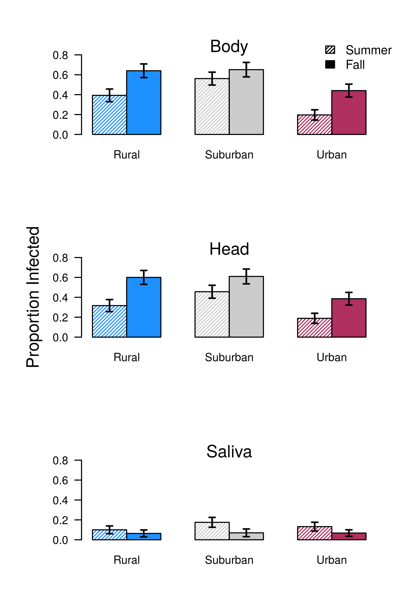

```{r setup, include=FALSE}
knitr::opts_chunk$set(echo = F)
knitr::opts_chunk$set(cache=TRUE)
knitr::opts_chunk$set(message=FALSE)
knitr::opts_chunk$set(warning=FALSE)
```

This document goes over the main results from the 2016 Athens Dengue Field Project.

# Infection Dynamics

**Methods Overview**: Mosquitoes were reared at 9 sites (3 rural, 3 surburban, 3 urban) and brought back to the lab to infect with dengue. Mosquitoes were reared in four trays at each site, but pooled by site for infections because there were not enough numbers. At 21 days post infection, they were processed to test for infection (body), dissemination (head), and infectiousness (saliva). This was repeated in the fall and summer. Climate data reported was averaged at the site level over the larval rearing period, and weighted to account for the amount of time mosquitoes spent in each tray.

## Infection by Class and Season

The first analysis was to determine how infection dynamics differed by class (rural, suburban, or urban) & season (summer or fall).



A binomial generalized linear mixed-effects model was fit to the data, with class and season and their interaction as fixed effects and site as a random effect. To test for significance, we calculated an analysis of variance table using a Type II Wald chisquare test for the fixed effects. Both class and season had significant effects on body and head infections (Table 1), however there was no effect of either on saliva infection.

## Infection and Microclimate

Based on our findings above, we wanted to investigate if these patterns across season and class could be driven by microclimate, and how.

## Infection and Winglength

