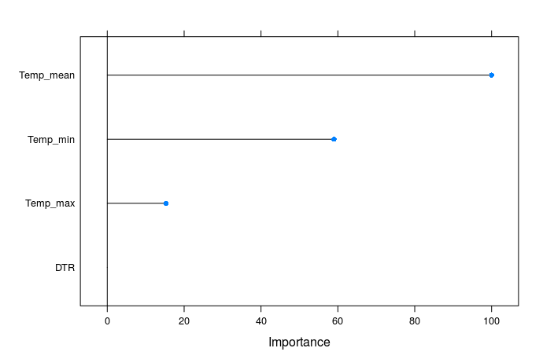
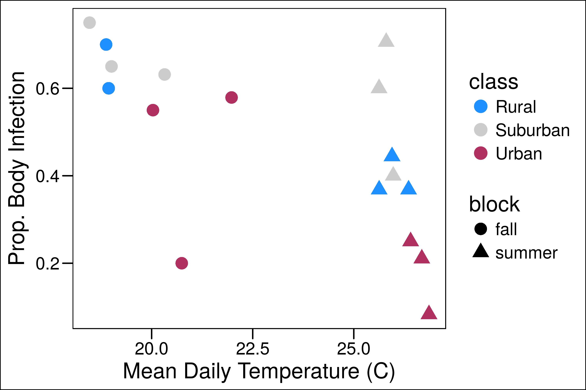
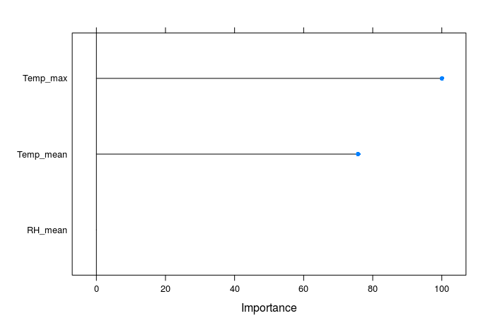
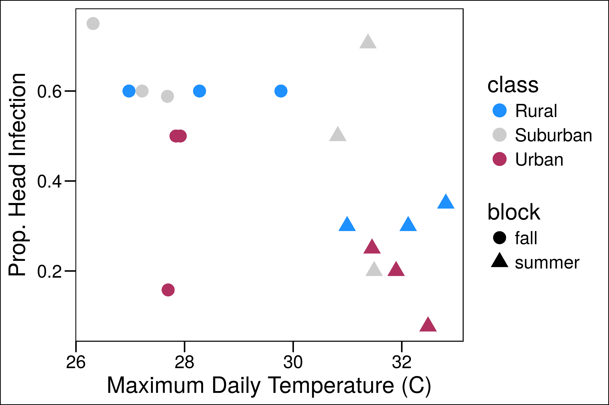
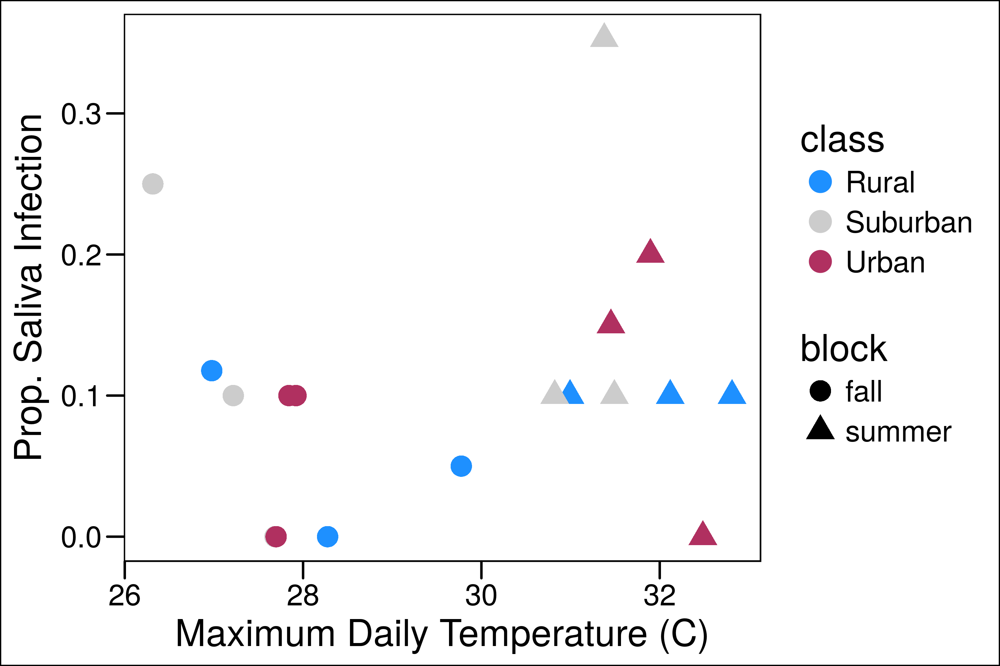

```{r setup, include=FALSE}
knitr::opts_chunk$set(echo = F)
knitr::opts_chunk$set(cache=TRUE)
knitr::opts_chunk$set(message=FALSE)
knitr::opts_chunk$set(warning=FALSE)
```

This document goes over the main results from the 2016 Athens Dengue Field Project.

# Infection Dynamics

**Methods Overview**: Mosquitoes were reared at 9 sites (3 rural, 3 surburban, 3 urban) and brought back to the lab to infect with dengue. Mosquitoes were reared in four trays at each site, but pooled by site for infections because there were not enough numbers. At 21 days post infection, they were processed to test for infection (body), dissemination (head), and infectiousness (saliva). This was repeated in the fall and summer. Climate data reported was averaged at the site level over the larval rearing period, and weighted to account for the amount of time mosquitoes spent in each tray.

## Infection by Class and Season

The first analysis was to determine how infection dynamics differed by class (rural, suburban, or urban) & season (summer or fall).


A binomial generalized linear mixed-effects model was fit to the data, with class and season and their interaction as fixed effects and site as a random effect. To test for significance, we calculated an analysis of variance table using a Type II Wald chisquare test for the fixed effects. Both class and season had significant effects on body and head infections, however there was no effect of either on saliva infection.

We found that infection in the body and head was significantly lower in the summer than the fall. Although there was a trend towards higher infection in the saliva in the summer, this was not significant (p=0.05676).  Land class also influence infection of both the body and head, with urban mosquitoes having lower rates of infection than rural and suburban mosquitoes. Saliva infections were unaffected by land class, however.

As both the summer season and urban land classes had the highest temperatures in their respecitive groups, this suggests that these differences in vector competence may be due to differences in temperature in the larval environment.

## Infection and Microclimate

Based on our findings above, we wanted to investigate if these patterns across season and class could be driven by microclimate, and how.

Becuase our experimental design was somewhat limited by the number of mosquitoes emerging, we grouped infections by site, rather than tray. This means that the microclimate data used is the same for all mosquitoes across sites, and that we cannot use it to predict individual level infections in a meaningful way, as we did for land class and season.  Therefore, our response variable in this analysis is the proportion of infected mosquitoes by site. This greatly reduces our sample size to 18, and therefore our statistical power.

The original starting set of variables were the average daily mean, minimum, and maximum temperature and relative humidity per site, daily temperature range, and  the average number of hours below 16C and above 31C. These temperature values were chosen based on thresholds from the Mordecai et al 2017 model of temperature dependence of dengue infections. Because maximum relative humidity is 100% for all sites, this variable was dropped. This resulted in eight total environmental covariates. Becuase temperature and relative humidity are so dependent on each other, this resulted in high correlations amongst the covariates.

To select covariates, I used a lasso regression in the `glmnet` package to conduct a stepwise regression selection process based on the RMSE.  At each step, the variable whose omission resulted in the greatest drop in RMSE was dropped from the model.  As the selection process continued, previously dropped variables were again included in the model at each step to determine any effect on RMSE, and if this increased the error, were left out of the final model. Model selection ended when the dropping of any of the included variables did not decrease the RMSE of the overall model.

### Body Infection

The final model included mean, minimum, and maximum temperatures and daily temperature range. The most important variable was mean temperature (Figure 2). Given the high correlation between these variables, I think the only thing we can say with confidence is that temperature is playing a role in infection dynamics, however, with the relatively low $R^2$ of our model ($R^2 = 0.4434$), it is clearly not the only important factor. 



The relationship between mean temperature and body infection is negative (Figure 3). Higher temperatures are correlated with lower body infection rates.  Additionally, the relationship seems qualitatively different over the seasons, with a stronger relationship in the summer than the fall. This may be because the summer temperatures are near the thermal optimum, where the effect of temperature is more pronounced.



### Head Infection

The final model included maximum and mean temperature and mean relative humidity. The most important variable was maximum temperature (Figure 4), however the difference in variable importance was less than in the Body regression. Although the mean relative humidity is included in this model, it is relatively unimportant.  This leads me to conclude that temperature is also the main driver in this model, as it was for body infection.



As above, we found that head infection rates decreased with increasing temperatures, particularly the maximum temperature (Figure 5). Again, the relationship differs slightly across the seasons.



### Saliva Infection

While saliva had no significant differences across land class, there was a slight trend towards higher saliva in the summer, although not significant. Therefore, I thought it would be informative to also look at the effect of microclimate on saliva infection.  Using similar methods above, the final model included maximum temperature, mean temperature, and mean relative humidity (Figure 6).  Interestingly the relationship between temperature and saliva infection is contrary to that seen for body and head infection, that is, it is positive. At higher temperatures, saliva infection rates were higher, although the effect is not as large as those seen earlier (Figure 7).


